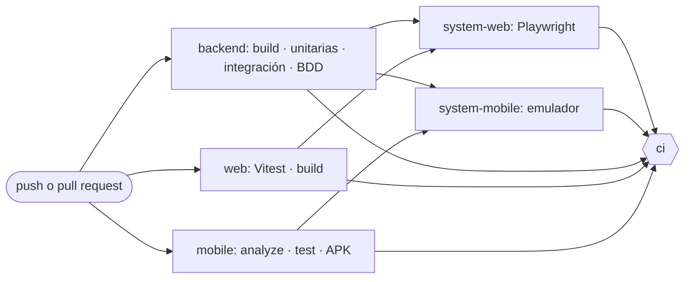

<div style="font-family: Arial, sans-serif; padding: 40px; width: 600px; margin: auto; text-align: center;">
    <div style="margin-bottom: 20px;">
        
    </div>
    <p style="margin: 5px;">Universidad Peruana de Ciencias Aplicadas</p>
    <p style="margin: 5px;">Carrera de Ingeniería de Software</p>
    <h2 style="font-size: 18px; margin: 15px 0 0 0;">1ASI0732</h2>
    <h2 style="font-size: 18px; margin: 10px 0 10px 0;">Diseño de Experimentos de Ingeniería de Software</h2>
    <p style="margin: 10px 0 5px 0;">NRC</p>
    <h2 style="font-size: 18px; margin: 5px 0;">9086</h2>
    <h2 style="font-size: 18px; margin: 10px 0 5px 0;">Informe de Trabajo Final</h2>
    <p style="margin: 10px 0 5px 0;">Docente</p>
    <h2 style="font-size: 18px; margin: 5px 0 40px 0;">Noriega Melendez, Julio Manuel</h2>
    <p style="margin: 10px 0 5px 0;">Equipo</p>
    <h2 style="font-size: 18px; margin: 0px 0 40px 0;">Nombre de Equipo</h2>
    <p style="margin: 5px;">Proyecto</p>
    <h2 style="font-size: 18px; margin: 0px 0 30px 0;">Nombre de Proyecto</h2>
    <p style="margin: 5px;"><strong>Integrantes:</strong></p>
    <table style="width: max-content; border-collapse: collapse; margin: 0 auto 50px auto;">
        <thead>
            <tr>
                <th style="border: 0px; text-align: left; padding: 5px 15px 5px 0;">Código</th>
                <th style="border: 0px; text-align: left; padding: 5px 0 5px 15px;">Apellidos y Nombres</th>
            </tr>
        </thead>
        <tbody>
            <tr>
                <td style="border: 0px; text-align: left; padding: 5px 15px 5px 0;">U202114701</td>
                <td style="border: 0px; text-align: left; padding: 5px 0 5px 15px;">Berrospi Marin Angel Guillermo</td>
            </tr>
            <tr>
                <td style="border: 0px; text-align: left; padding: 5px 15px 5px 0;">U202222745</td>
                <td style="border: 0px; text-align: left; padding: 5px 0 5px 15px;">Guerrero Tomas Nelson Fabrizio</td>
            </tr>
            <tr>
                <td style="border: 0px; text-align: left; padding: 5px 15px 5px 0;">U20221F192</td>
                <td style="border: 0px; text-align: left; padding: 5px 0 5px 15px;">Saldaña De Souza, Juan David</td>
            </tr>
        </tbody>
    </table>
    <div style="margin-top: 40px;">
        <p style="margin: 5px;">Periodo 2026-20</p>
    </div>
</div>

<div style="page-break-after: always;"></div>

## Registro de Versiones del Informe

| Versión | Fecha | Autor | Descripción de modificación |
| --- | --- | --- | --- |
| 1.0 | 2026-09-11 | Guerrero Tomas Nelson Fabrizio | Creación de la estructura inicial del informe (carátula, tabla de contenidos y secciones) siguiendo el enunciado del trabajo final. |
| 1.0 | 2026-09-16 | Berrospi Marin Angel Guillermo | Desarrollo de Entrevistas en base a los requerimientos para el avance del proyecto. |
| 1.1 | 2026-10-07 | Guerrero Tomas Nelson Fabrizio | Capítulo V: Product Implementation (configuración, sprints 1 y 2, evidencias de los productos desplegados y acuerdo de servicio SaaS). |
| 1.2 | 2026-10-07 | Guerrero Tomas Nelson Fabrizio | Secciones 6.1 Testing Suites & Validation y 7.1 Continuous Integration; historias US17 y US18 y criterios actualizados en 3.2 y 3.3. |

<div style="page-break-after: always;"></div>

## Project Report Collaboration Insights

> URL del repositorio (organización de GitHub del equipo): _Pendiente de completar._

Para cada entrega se debe explicar cómo se han desarrollado las actividades de elaboración del informe y presentar capturas de los analíticos de colaboración y commits en GitHub, realizados por los miembros del equipo. Debe tener coherencia con el [Registro de Versiones del Informe](#registro-de-versiones-del-informe).

### Avance 1

_Pendiente de completar._

### Avance 2

_Pendiente de completar._

### Trabajo Parcial

_Pendiente de completar._

### Trabajo Final

_Pendiente de completar._

<div style="page-break-after: always;"></div>

## Contenido

- [Registro de Versiones del Informe](#registro-de-versiones-del-informe)
- [Project Report Collaboration Insights](#project-report-collaboration-insights)
  - [Avance 1](#avance-1)
  - [Avance 2](#avance-2)
  - [Trabajo Parcial](#trabajo-parcial)
  - [Trabajo Final](#trabajo-final)
- [Student Outcome](#student-outcome)
  - [Subsección por integrante](#subsección-por-integrante)
    - [Guerrero Tomas Nelson Fabrizio](#guerrero-tomas-nelson-fabrizio)
  - [Cuadro de Student Outcome](#cuadro-de-student-outcome)
- [Part I: As-Is Software Project](#part-i-as-is-software-project)
  - [Capítulo I: Introducción](#capítulo-i-introducción)
    - [1.1. Startup Profile](#11-startup-profile)
      - [1.1.1. Descripción de la Startup](#111-descripción-de-la-startup)
      - [1.1.2. Perfiles de integrantes del equipo](#112-perfiles-de-integrantes-del-equipo)
    - [1.2. Solution Profile](#12-solution-profile)
      - [1.2.1. Antecedentes y problemática](#121-antecedentes-y-problemática)
      - [1.2.2. Lean UX Process](#122-lean-ux-process)
        - [1.2.2.1. Lean UX Problem Statements](#1221-lean-ux-problem-statements)
        - [1.2.2.2. Lean UX Assumptions](#1222-lean-ux-assumptions)
        - [1.2.2.3. Lean UX Hypothesis Statements](#1223-lean-ux-hypothesis-statements)
        - [1.2.2.4. Lean UX Canvas](#1224-lean-ux-canvas)
    - [1.3. Segmentos objetivo](#13-segmentos-objetivo)
  - [Capítulo II: Requirements Elicitation & Analysis](#capítulo-ii-requirements-elicitation--analysis)
    - [2.1. Competidores](#21-competidores)
      - [2.1.1. Análisis competitivo](#211-análisis-competitivo)
      - [2.1.2. Estrategias y tácticas frente a competidores](#212-estrategias-y-tácticas-frente-a-competidores)
    - [2.2. Entrevistas](#22-entrevistas)
      - [2.2.1. Diseño de entrevistas](#221-diseño-de-entrevistas)
      - [2.2.2. Registro de entrevistas](#222-registro-de-entrevistas)
      - [2.2.3. Análisis de entrevistas](#223-análisis-de-entrevistas)
    - [2.3. Needfinding](#23-needfinding)
      - [2.3.1. User Personas](#231-user-personas)
      - [2.3.2. User Task Matrix](#232-user-task-matrix)
      - [2.3.3. User Journey Mapping](#233-user-journey-mapping)
      - [2.3.4. Empathy Mapping](#234-empathy-mapping)
      - [2.3.5. As-is Scenario Mapping](#235-as-is-scenario-mapping)
    - [2.4. Ubiquitous Language](#24-ubiquitous-language)
  - [Capítulo III: Requirements Specification](#capítulo-iii-requirements-specification)
    - [3.1. To-Be Scenario Mapping](#31-to-be-scenario-mapping)
    - [3.2. User Stories](#32-user-stories)
    - [3.3. Product Backlog](#33-product-backlog)
    - [3.4. Impact Mapping](#34-impact-mapping)
  - [Capítulo IV: Product Design](#capítulo-iv-product-design)
    - [4.1. Style Guidelines](#41-style-guidelines)
      - [4.1.1. General Style Guidelines](#411-general-style-guidelines)
      - [4.1.2. Web Style Guidelines](#412-web-style-guidelines)
      - [4.1.3. Mobile Style Guidelines](#413-mobile-style-guidelines)
        - [4.1.3.1. iOS Mobile Style Guidelines](#4131-ios-mobile-style-guidelines)
        - [4.1.3.2. Android Mobile Style Guidelines](#4132-android-mobile-style-guidelines)
    - [4.2. Information Architecture](#42-information-architecture)
      - [4.2.1. Organization Systems](#421-organization-systems)
      - [4.2.2. Labeling Systems](#422-labeling-systems)
      - [4.2.3. SEO Tags and Meta Tags](#423-seo-tags-and-meta-tags)
      - [4.2.4. Searching Systems](#424-searching-systems)
      - [4.2.5. Navigation Systems](#425-navigation-systems)
    - [4.3. Landing Page UI Design](#43-landing-page-ui-design)
      - [4.3.1. Landing Page Wireframe](#431-landing-page-wireframe)
      - [4.3.2. Landing Page Mock-up](#432-landing-page-mock-up)
    - [4.4. Mobile Applications UX/UI Design](#44-mobile-applications-uxui-design)
      - [4.4.1. Mobile Applications Wireframes](#441-mobile-applications-wireframes)
      - [4.4.2. Mobile Applications Wireflow Diagrams](#442-mobile-applications-wireflow-diagrams)
      - [4.4.3. Mobile Applications Mock-ups](#443-mobile-applications-mock-ups)
      - [4.4.4. Mobile Applications User Flow Diagrams](#444-mobile-applications-user-flow-diagrams)
    - [4.5. Mobile Applications Prototyping](#45-mobile-applications-prototyping)
      - [4.5.1. Android Mobile Applications Prototyping](#451-android-mobile-applications-prototyping)
      - [4.5.2. iOS Mobile Applications Prototyping](#452-ios-mobile-applications-prototyping)
    - [4.6. Web Applications UX/UI Design](#46-web-applications-uxui-design)
      - [4.6.1. Web Applications Wireframes](#461-web-applications-wireframes)
      - [4.6.2. Web Applications Wireflow Diagrams](#462-web-applications-wireflow-diagrams)
      - [4.6.3. Web Applications Mock-ups](#463-web-applications-mock-ups)
      - [4.6.4. Web Applications User Flow Diagrams](#464-web-applications-user-flow-diagrams)
    - [4.7. Web Applications Prototyping](#47-web-applications-prototyping)
    - [4.8. Domain-Driven Software Architecture](#48-domain-driven-software-architecture)
      - [4.8.1. Software Architecture Context Diagram](#481-software-architecture-context-diagram)
      - [4.8.2. Software Architecture Container Diagrams](#482-software-architecture-container-diagrams)
      - [4.8.3. Software Architecture Components Diagrams](#483-software-architecture-components-diagrams)
    - [4.9. Software Object-Oriented Design](#49-software-object-oriented-design)
      - [4.9.1. Class Diagrams](#491-class-diagrams)
      - [4.9.2. Class Dictionary](#492-class-dictionary)
    - [4.10. Database Design](#410-database-design)
      - [4.10.1. Relational/Non-Relational Database Diagram](#4101-relationalnon-relational-database-diagram)
  - [Capítulo V: Product Implementation](#capítulo-v-product-implementation)
    - [5.1. Software Configuration Management](#51-software-configuration-management)
      - [5.1.1. Software Development Environment Configuration](#511-software-development-environment-configuration)
      - [5.1.2. Source Code Management](#512-source-code-management)
      - [5.1.3. Source Code Style Guide & Conventions](#513-source-code-style-guide--conventions)
      - [5.1.4. Software Deployment Configuration](#514-software-deployment-configuration)
    - [5.2. Product Implementation & Deployment](#52-product-implementation--deployment)
      - [5.2.1. Sprint Backlogs](#521-sprint-backlogs)
        - [Sprint 1](#sprint-1)
        - [Sprint 2](#sprint-2)
      - [5.2.2. Implemented Landing Page Evidence](#522-implemented-landing-page-evidence)
      - [5.2.3. Implemented Frontend-Web Application Evidence](#523-implemented-frontend-web-application-evidence)
      - [5.2.4. Acuerdo de Servicio - SaaS](#524-acuerdo-de-servicio---saas)
      - [5.2.5. Implemented Native-Mobile Application Evidence](#525-implemented-native-mobile-application-evidence)
      - [5.2.6. Implemented RESTful API and/or Serverless Backend Evidence](#526-implemented-restful-api-andor-serverless-backend-evidence)
      - [5.2.7. RESTful API documentation](#527-restful-api-documentation)
      - [5.2.8. Team Collaboration Insights](#528-team-collaboration-insights)
    - [5.3. Video About-the-Product](#53-video-about-the-product)
- [Part II: Verification, Validation & Pipeline](#part-ii-verification-validation--pipeline)
  - [Capítulo VI: Product Verification & Validation](#capítulo-vi-product-verification--validation)
    - [6.1. Testing Suites & Validation](#61-testing-suites--validation)
      - [6.1.1. Core Entities Unit Tests](#611-core-entities-unit-tests)
      - [6.1.2. Core Integration Tests](#612-core-integration-tests)
      - [6.1.3. Core Behavior-Driven Development](#613-core-behavior-driven-development)
      - [6.1.4. Core System Tests](#614-core-system-tests)
    - [6.2. Static testing & Verification](#62-static-testing--verification)
      - [6.2.1. Static Code Analysis](#621-static-code-analysis)
        - [6.2.1.1. Coding standard & Code conventions](#6211-coding-standard--code-conventions)
        - [6.2.1.2. Code Quality & Code Security](#6212-code-quality--code-security)
      - [6.2.2. Reviews](#622-reviews)
    - [6.3. Validation Interviews](#63-validation-interviews)
      - [6.3.1. Diseño de Entrevistas](#631-diseño-de-entrevistas)
      - [6.3.2. Registro de Entrevistas](#632-registro-de-entrevistas)
      - [6.3.3. Evaluaciones según heurísticas](#633-evaluaciones-según-heurísticas)
    - [6.4. Auditoría de Experiencias de Usuario](#64-auditoría-de-experiencias-de-usuario)
      - [6.4.1. Auditoría realizada](#641-auditoría-realizada)
        - [6.4.1.1. Información del grupo auditado](#6411-información-del-grupo-auditado)
        - [6.4.1.2. Cronograma de auditoría realizada](#6412-cronograma-de-auditoría-realizada)
        - [6.4.1.3. Contenido de auditoría realizada](#6413-contenido-de-auditoría-realizada)
      - [6.4.2. Auditoría recibida](#642-auditoría-recibida)
        - [6.4.2.1. Información del grupo auditor](#6421-información-del-grupo-auditor)
        - [6.4.2.2. Cronograma de auditoría recibida](#6422-cronograma-de-auditoría-recibida)
        - [6.4.2.3. Contenido de auditoría recibida](#6423-contenido-de-auditoría-recibida)
        - [6.4.2.4. Resumen de modificaciones para subsanar hallazgos](#6424-resumen-de-modificaciones-para-subsanar-hallazgos)
  - [Capítulo VII: DevOps Practices](#capítulo-vii-devops-practices)
    - [7.1. Continuous Integration](#71-continuous-integration)
      - [7.1.1. Tools and Practices](#711-tools-and-practices)
      - [7.1.2. Build & Test Suite Pipeline Components](#712-build--test-suite-pipeline-components)
    - [7.2. Continuous Delivery](#72-continuous-delivery)
      - [7.2.1. Tools and Practices](#721-tools-and-practices)
      - [7.2.2. Stages Deployment Pipeline Components](#722-stages-deployment-pipeline-components)
    - [7.3. Continuous deployment](#73-continuous-deployment)
      - [7.3.1. Tools and Practices](#731-tools-and-practices)
      - [7.3.2. Production Deployment Pipeline Components](#732-production-deployment-pipeline-components)
    - [7.4. Continuous Monitoring](#74-continuous-monitoring)
      - [7.4.1. Tools and Practices](#741-tools-and-practices)
      - [7.4.2. Monitoring Pipeline Components](#742-monitoring-pipeline-components)
      - [7.4.3. Alerting Pipeline Components](#743-alerting-pipeline-components)
      - [7.4.4. Notification Pipeline Components](#744-notification-pipeline-components)
- [Part III: Experiment-Driven Lifecycle](#part-iii-experiment-driven-lifecycle)
  - [Capítulo VIII: Experiment-Driven Development](#capítulo-viii-experiment-driven-development)
    - [8.1. Experiment Planning](#81-experiment-planning)
      - [8.1.1. As-Is Summary](#811-as-is-summary)
      - [8.1.2. Raw Material: Assumptions, Knowledge Gaps, Ideas, Claims](#812-raw-material-assumptions-knowledge-gaps-ideas-claims)
      - [8.1.3. Experiment-Ready Questions](#813-experiment-ready-questions)
      - [8.1.4. Question Backlog](#814-question-backlog)
      - [8.1.5. Experiment Cards](#815-experiment-cards)
    - [8.2. Experiment Design](#82-experiment-design)
      - [8.2.1. Hypotheses](#821-hypotheses)
      - [8.2.2. Domain Business Metrics](#822-domain-business-metrics)
      - [8.2.3. Measures](#823-measures)
      - [8.2.4. Conditions](#824-conditions)
      - [8.2.5. Scale Calculations and Decisions](#825-scale-calculations-and-decisions)
      - [8.2.6. Methods Selection](#826-methods-selection)
      - [8.2.7. Data Analytics: Goals, KPIs and Metrics Selection](#827-data-analytics-goals-kpis-and-metrics-selection)
      - [8.2.8. Web and Mobile Tracking Plan](#828-web-and-mobile-tracking-plan)
    - [8.3. Experimentation](#83-experimentation)
      - [8.3.1. To-Be User Stories](#831-to-be-user-stories)
      - [8.3.2. To-Be Product Backlog](#832-to-be-product-backlog)
      - [8.3.3. Pipeline-supported, Experiment-Driven To-Be Software Platform Lifecycle](#833-pipeline-supported-experiment-driven-to-be-software-platform-lifecycle)
        - [8.3.3.1. To-Be Sprint Backlogs](#8331-to-be-sprint-backlogs)
        - [8.3.3.2. Implemented To-Be Landing Page Evidence](#8332-implemented-to-be-landing-page-evidence)
        - [8.3.3.3. Implemented To-Be Frontend-Web Application Evidence](#8333-implemented-to-be-frontend-web-application-evidence)
        - [8.3.3.4. Implemented To-Be Native-Mobile Application Evidence](#8334-implemented-to-be-native-mobile-application-evidence)
        - [8.3.3.5. Implemented To-Be RESTful API and/or Serverless Backend Evidence](#8335-implemented-to-be-restful-api-andor-serverless-backend-evidence)
        - [8.3.3.6. Team Collaboration Insights](#8336-team-collaboration-insights)
      - [8.3.4. To-Be Validation Interviews](#834-to-be-validation-interviews)
        - [8.3.4.1. Diseño de Entrevistas](#8341-diseño-de-entrevistas)
        - [8.3.4.2. Registro de Entrevistas](#8342-registro-de-entrevistas)
    - [8.4. Experiment Aftermath & Analysis](#84-experiment-aftermath--analysis)
      - [8.4.1. Analysis and Interpretation of Results](#841-analysis-and-interpretation-of-results)
      - [8.4.2. Re-scored and Re-prioritized Question Backlog](#842-re-scored-and-re-prioritized-question-backlog)
    - [8.5. Continuous Learning](#85-continuous-learning)
      - [8.5.1. Shareback Session Artifacts: Learning Workflow](#851-shareback-session-artifacts-learning-workflow)
    - [8.6. To-Be Software Platform Pre-launch](#86-to-be-software-platform-pre-launch)
      - [8.6.1. About-the-Product Intro Video](#861-about-the-product-intro-video)
      - [8.6.2. Resumen usando Gees FrameWork](#862-resumen-usando-gees-framework)
- [Matriz de Evaluación Ética y de Impacto](#matriz-de-evaluación-ética-y-de-impacto)
- [Conclusiones](#conclusiones)
  - [Conclusiones y recomendaciones](#conclusiones-y-recomendaciones)
  - [Video App Validation](#video-app-validation)
  - [Video About-the-Team](#video-about-the-team)
- [Bibliografía](#bibliografía)
- [Anexos](#anexos)

<div style="page-break-after: always;"></div>

## Student Outcome

Cada participante del equipo debe colaborar a fin de que se redacte como grupo los sustentos y evidencias de las actividades realizadas en el trabajo final han ayudado a desarrollar cómo las dimensiones del student outcome. Por ello en esta sección debe quedar descrito por escrito, la relación entre el outcome, sus dimensiones y el trabajo que han realizado. Esto se complementa con lo reflejado en los testimonios expuestos que forman parte del video *About The Team*.

El curso contribuye al cumplimiento del Student Outcome ABET:

**ABET – EAC - Student Outcome 4**
**Criterio**: La capacidad de reconocer responsabilidades éticas y profesionales en situaciones de ingeniería y hacer juicios informados, que deben considerar el impacto de las soluciones de ingeniería en contextos globales, económicos, ambientales y sociales.

### Subsección por integrante

> Debe existir una subsección con este formato por cada integrante del equipo.

#### Guerrero Tomas Nelson Fabrizio

_Pendiente de completar: descripción por escrito de la relación entre el outcome, sus dimensiones y el trabajo realizado por este integrante._

### Cuadro de Student Outcome

En el siguiente cuadro se describen las acciones realizadas y enunciados de conclusiones por parte del grupo, que permiten sustentar el haber alcanzado el logro del ABET – EAC - Student Outcome 4.

| Criterio específico | Acciones realizadas | Conclusiones |
| --- | --- | --- |
| 4.c.1 Reconoce responsabilidad ética y profesional en situaciones de ingeniería de software | _Pendiente de completar._ | _Pendiente de completar._ |
| 4.c.2 Emite juicios informados considerando el impacto de las soluciones de ingeniería de software en contextos globales, económicos, ambientales y sociales | _Pendiente de completar._ | _Pendiente de completar._ |

<div style="page-break-after: always;"></div>

# Part I: As-Is Software Project

# Capítulo I: Introducción

## 1.1. Startup Profile

### 1.1.1. Descripción de la Startup


PawCode Studio es una startup de desarrollo de software conformada por
estudiantes de la carrera de Ingeniería de Software de la Universidad
Peruana de Ciencias Aplicadas. Nace con el propósito de llevar procesos
administrativos y clínicos que aún dependen del papel hacia soluciones
digitales confiables, verificables y accesibles para negocios de pequeña
y mediana escala del Perú.


Nuestro primer producto es **VetPass**, una plataforma web y móvil que
digitaliza la cartilla de vacunación y el historial veterinario de perros
y gatos. La plataforma permite que el personal de la clínica registre la
información desde una aplicación web, mientras que el dueño de la mascota
la consulta en cualquier momento desde una aplicación móvil, eliminando
la dependencia de documentos físicos expuestos a pérdida o deterioro.

**Misión:** Digitalizar la gestión de la información clínica de mascotas
en clínicas veterinarias pequeñas y medianas del Perú, mediante productos
de software construidos con altos estándares de calidad, verificación
continua y diseño centrado en el usuario.

**Visión:** Ser en los próximos cinco años la plataforma de referencia en
el Perú para el registro y consulta del historial sanitario de mascotas,
reconocida por la confiabilidad de su información y por la calidad de su
ingeniería.

### 1.1.2. Perfiles de integrantes del equipo

A continuación se presentan los perfiles de los integrantes de PawCode
Studio, indicando sus datos de identificación académica y los principales
conocimientos técnicos y habilidades que cada uno aporta al equipo.

| Foto | Nombres y Apellidos | Código de estudiante | Carrera | Conocimientos técnicos y habilidades |
|------|---------------------|----------------------|---------|--------------------------------------|
|  | Berrospi Marin, Angel Guillermo | U202114701 | Ingeniería de Software |Soy estudiante de la carrera de Ingeniería de Software. Tendre el compromiso con mi equipo en ser proactivo, productivo, siempre apoyar en lo que se necesite y mantener una comunicación fluida. Cuento con conocimientos en html, css, javascript, Java y SQL, lo cual puede ser de ayuda en el desarrollo del proyecto. |
|  | Apellido Apellido, Nombre | U202222745 | Ingeniería de Software | Arquitectura de Software <|
|  | Saldaña De Souza, Juan David | U20221F192 | Ingeniería de Software | Desarrollo web (Angular, Spring Boot), bases de datos relacionales y no relacionales, control de versiones con Git, y conocimientos en diseño de software orientado a objetos. |
|  | Apellido Apellido, Nombre | U20XXXXXX | Ingeniería de Software | |
|  | Apellido Apellido, Nombre | U20XXXXXX | Ingeniería de Software | |


## 1.2. Solution Profile

### 1.2.1. Antecedentes y problemática


#### Análisis previo: The 5 'W's and 2 'H's

Antes de redactar los antecedentes y la problemática, el equipo aplicó la
técnica de análisis 5W+2H sobre el dominio del problema, con el fin de
delimitarlo de forma precisa y evitar conclusiones apresuradas.

| Dimensión | Pregunta guía | Hallazgo |
|-----------|---------------|----------|
| **What** (Qué) | ¿Cuál es el problema? | El historial clínico de las mascotas y su cartilla de vacunación se gestionan en papel. La cartilla queda en poder del dueño y el historial queda en la clínica, de modo que ningún actor posee el registro completo del animal, y ambos documentos son susceptibles de pérdida, deterioro u olvido. |
| **Who** (Quién) | ¿A quiénes afecta? | Al personal de clínicas veterinarias pequeñas y medianas (médico veterinario tratante y personal de recepción), responsable de registrar y consultar la información clínica; y a los dueños de perros y gatos, responsables de custodiar la cartilla física y de informar los antecedentes del animal en cada atención. |
| **Where** (Dónde) | ¿Dónde ocurre? | En clínicas y consultorios veterinarios independientes de Lima Metropolitana, que no cuentan con sistemas de información clínica y operan con registros manuales. |
| **When** (Cuándo) | ¿Cuándo se manifiesta? | En el momento de la atención, cuando el veterinario requiere los antecedentes del paciente y no dispone de ellos; cuando el dueño extravía o deteriora la cartilla; y cuando el dueño acude por primera vez a una clínica distinta y no puede acreditar el historial de vacunación de su mascota. |
| **Why** (Por qué) | ¿Por qué es relevante resolverlo? | Porque la ausencia de información verificable conduce a decisiones clínicas tomadas sobre datos incompletos, a la repetición u omisión de dosis de vacunas, y a reprocesos administrativos que consumen tiempo de atención. Además, compromete la trazabilidad sanitaria del animal a lo largo de su vida. |
| **How** (Cómo) | ¿Cómo ocurre actualmente? | La clínica registra cada atención de forma manuscrita en fichas u hojas que se archivan apiladas o en folders físicos, sin índice ni respaldo. Paralelamente, entrega al dueño una cartilla de vacunación impresa que se completa a mano en cada dosis aplicada. No existe copia de seguridad de ninguno de los dos documentos. |
| **How much** (Cuánto) | ¿Cuál es la magnitud? | El INEI (2026) reporta que el 64,0% de los hogares peruanos tiene al menos una mascota, con un total de 17 263 000 animales de compañía a nivel nacional, de los cuales el 56,5% son perros y el 36,2% son gatos. En Lima Metropolitana, el 59,6% de los hogares cuenta con algún animal de compañía. Cada uno de esos animales requiere, como mínimo, un esquema de vacunación documentado y verificable. |

#### Antecedentes

La tenencia de animales de compañía en el Perú alcanza una escala
significativa. Según el módulo "Crianza de mascotas en el hogar" de la
Encuesta Nacional de Hogares, incorporado por el Instituto Nacional de
Estadística e Informática (INEI) en 2025 y difundido en 2026, el 64,0% de
los hogares del país tiene al menos una mascota, con un promedio de 2,5
animales por hogar. El 52,2% de los hogares cuenta con al menos un perro
y el 33,0% con al menos un gato, lo que confirma a ambas especies como
las predominantes en el dominio del problema.

Este volumen de animales sostiene una red amplia de clínicas y
consultorios veterinarios, en su mayoría negocios independientes de
pequeña y mediana escala. En dichos establecimientos, la gestión de la
información clínica continúa apoyándose en instrumentos físicos: fichas
manuscritas de atención que se archivan en folders, y una cartilla de
vacunación impresa que se entrega al dueño de la mascota y se completa a
mano cada vez que se aplica una dosis.

Este esquema de trabajo divide el expediente del animal en dos mitades
que nunca se encuentran. La clínica conserva el registro de las atenciones
que ella misma brindó, pero no necesariamente el de las vacunas aplicadas
en otros establecimientos. El dueño conserva la cartilla, pero no el
detalle clínico de cada consulta. Cuando cualquiera de las dos mitades se
pierde, no existe mecanismo alguno de recuperación, porque no hay copia
de respaldo.

#### Problemática

La gestión en papel del historial veterinario y de la cartilla de
vacunación de perros y gatos genera pérdida de información clínica
irrecuperable y decisiones médicas basadas en antecedentes incompletos.

Los puntos más importantes que la solución debe resolver son los
siguientes:

1. **Fragilidad del soporte físico.** La cartilla de vacunación es un
   documento de papel que acompaña al animal durante toda su vida y que
   se extravía, se moja o se deteriora con facilidad. Cuando esto ocurre,
   el registro histórico de dosis aplicadas se pierde por completo.

2. **Ausencia de respaldo del historial clínico.** Las fichas de atención
   apiladas en la clínica carecen de copia de seguridad y de un criterio
   de organización que permita recuperar con rapidez los antecedentes de
   un paciente determinado.

3. **Información dispersa entre actores.** Ni la clínica ni el dueño
   poseen individualmente el expediente completo del animal, lo que
   obliga al veterinario a reconstruir los antecedentes a partir de lo
   que el dueño recuerda.

4. **Falta de control sobre el esquema de vacunación.** Al registrarse
   las dosis de forma manuscrita y sin validación, resulta difícil
   determinar con certeza qué vacunas le corresponden a la mascota según
   su especie y edad, cuáles ya recibió y cuáles se encuentran
   pendientes o vencidas.

5. **Imposibilidad de consulta por parte del dueño.** El dueño solo puede
   revisar la información de su mascota si conserva físicamente la
   cartilla, y no tiene acceso alguno al detalle de las atenciones
   registradas por la clínica.

#### Objetivos de la solución

**Objetivo general**

Desarrollar una plataforma de software compuesta por una aplicación web y
una aplicación móvil que permita a las clínicas veterinarias registrar y
mantener de forma digital la cartilla de vacunación y el historial
veterinario de perros y gatos, y que permita a los dueños consultar dicha
información en cualquier momento.

**Objetivos específicos**

- Generar automáticamente la cartilla de vacunación de una mascota a
  partir del esquema de vacunación correspondiente a su especie, al
  momento de su registro en la plataforma.
- Permitir al personal veterinario registrar la aplicación de cada dosis
  y determinar el estado de la cartilla de la mascota.
- Permitir al personal veterinario registrar las atenciones del historial
  veterinario mediante un formato preestablecido.
- Permitir al dueño consultar desde su dispositivo móvil el perfil, la
  cartilla de vacunación y el historial de cada una de sus mascotas.
- Permitir la emisión de recetas médicas asociadas a una atención y su
  consulta por parte del dueño.

#### Restricciones y delimitación del alcance

El alcance del proyecto se delimita de forma deliberada para concentrar
el esfuerzo del equipo en la calidad de la construcción, la verificación
y la validación del producto, que constituyen el objeto del curso. En
consecuencia, se establecen las siguientes restricciones:

- La plataforma soporta únicamente las especies **canina y felina**, por
  ser las predominantes en la atención veterinaria de acuerdo con las
  cifras del INEI citadas.
- El registro y la edición de información clínica son atribución
  exclusiva del personal de la clínica veterinaria. El dueño de la
  mascota dispone únicamente de permisos de consulta.
- El esquema de vacunación por especie se administra como una plantilla
  predefinida en el sistema, y no es configurable por el usuario final
  en esta versión del producto.
- Quedan fuera del alcance: la reserva de citas, los módulos de pagos y
  facturación, la gestión de inventario de medicamentos, los servicios
  de baño y estética, la telemedicina, las notificaciones push, el
  comercio electrónico y la administración de cadenas veterinarias con
  múltiples sedes.

### 1.2.2. Lean UX Process

El equipo aplicó el proceso Lean UX sobre el dominio del problema, con el
propósito de partir de supuestos explícitos y convertirlos en hipótesis
verificables, en lugar de asumir como válida la solución inicialmente
imaginada. El resultado de este proceso se presenta a continuación en
cuatro artefactos: los enunciados de problema, los supuestos, las
hipótesis y el Lean UX Canvas que los consolida.

#### 1.2.2.1. Lean UX Problem Statements

**Dominio**

Gestión de la información clínica y sanitaria de animales de compañía en
clínicas veterinarias de pequeña y mediana escala.

**Segmentos de clientes**

Personal de clínicas veterinarias independientes de Lima Metropolitana
(médico veterinario tratante y personal de recepción), y dueños de perros
y gatos atendidos en dichos establecimientos.

**Pain points**

El registro clínico manuscrito carece de respaldo y de un criterio de
recuperación rápida; la cartilla de vacunación en papel se extravía y se
deteriora; el expediente del animal queda dividido entre la clínica y el
dueño, de modo que ninguno de los dos lo posee completo; y no existe un
control confiable sobre qué dosis del esquema de vacunación corresponden
a la mascota, cuáles ya recibió y cuáles están pendientes o vencidas.

**Gap**

Existen sistemas de gestión veterinaria en el mercado, pero se orientan
principalmente a la administración comercial del negocio (citas,
facturación, inventario) y no resuelven el acceso del dueño a la
información sanitaria de su mascota. A la vez, las clínicas pequeñas
carecen de una herramienta accesible que digitalice específicamente la
cartilla de vacunación con las reglas del esquema sanitario incorporadas,
por lo que permanecen en el papel.

**Visión y estrategia**

La visión es que el expediente sanitario de una mascota deje de depender
de un documento físico y pase a residir en una plataforma en la que la
clínica lo construye y el dueño lo consulta. La estrategia consiste en
comenzar por el activo de información más frágil y a la vez más
normalizado —la cartilla de vacunación de perros y gatos—, generándola de
forma automática a partir del esquema de cada especie, y extender desde
allí hacia el historial de atenciones.

**Segmento inicial**

Clínicas veterinarias independientes de Lima Metropolitana con uno a tres
médicos veterinarios, que actualmente gestionan sus registros en papel y
no cuentan con un sistema de información clínica.

**Enunciados de problema**

*Enunciado 1 — Segmento clínica veterinaria*

Las clínicas veterinarias independientes registran el historial de sus
pacientes en fichas manuscritas y entregan a sus clientes una cartilla de
vacunación impresa. Hemos observado que este esquema no permite conservar
un expediente sanitario completo ni verificable de cada animal, lo cual
está causando que los veterinarios tomen decisiones clínicas sobre
antecedentes incompletos y que se inviertan minutos de la consulta en
reconstruir información que debería estar disponible. ¿Cómo podríamos
digitalizar el registro clínico y la cartilla de vacunación de modo que
el personal de la clínica disponga del expediente completo de cada
paciente al iniciar una atención?

*Enunciado 2 — Segmento dueño de mascota*

Los dueños de perros y gatos custodian la cartilla de vacunación de su
mascota en papel y desconocen el detalle de las atenciones registradas
por la clínica. Hemos observado que este documento se extravía y se
deteriora, y que su pérdida es irreversible, lo cual está causando que el
dueño no pueda acreditar el estado de vacunación de su mascota ni
determinar qué dosis le corresponden a continuación. ¿Cómo podríamos
ofrecer al dueño acceso permanente y confiable a la cartilla y al
historial de su mascota de modo que deje de depender de un documento
físico?

#### 1.2.2.2. Lean UX Assumptions

**Supuestos de negocio (Business Assumptions)**

1. Creemos que las clínicas veterinarias independientes de Lima
   Metropolitana gestionan mayoritariamente sus registros clínicos en
   papel.
2. Creemos que el personal veterinario percibe la reconstrucción de
   antecedentes de un paciente como una pérdida de tiempo dentro de la
   consulta.
3. Creemos que la pérdida o el deterioro de la cartilla de vacunación es
   un hecho frecuente y no un caso aislado.
4. Creemos que ofrecer al cliente acceso digital a la información de su
   mascota constituye un diferencial de servicio que la clínica valora.
5. Creemos que el esquema de vacunación de perros y de gatos está
   suficientemente estandarizado como para ser modelado en una plantilla
   predefinida por especie.
6. Creemos que las clínicas del segmento inicial disponen de una
   computadora con acceso a internet en el área de atención.
7. Creemos que los dueños de mascotas del segmento cuentan con un
   teléfono inteligente y están dispuestos a instalar una aplicación para
   consultar la información de su mascota.
8. Creemos que la clínica no aceptaría que el dueño pudiera editar el
   contenido clínico registrado por el veterinario.
9. Creemos que el mercado al que nos dirigimos es suficientemente amplio
   como para sostener el producto, considerando el volumen de tenencia de
   mascotas reportado por el INEI.

**Supuestos de usuario (User Assumptions)**

| Pregunta | Supuesto del equipo |
|----------|---------------------|
| ¿Quién es el usuario? | Por un lado, el médico veterinario y el personal de recepción de una clínica independiente. Por otro, el dueño de un perro o un gato atendido en esa clínica. |
| ¿Dónde encaja nuestro producto en su trabajo o vida? | En la clínica, durante el momento de la atención y el registro posterior. En el caso del dueño, en los momentos puntuales en que necesita consultar el estado sanitario de su mascota. |
| ¿Qué problemas resuelve nuestro producto? | Elimina la dependencia del papel como único soporte del expediente sanitario y hace que la información sea recuperable y consultable por ambas partes. |
| ¿Cuándo y cómo es usado nuestro producto? | La aplicación web se usa de forma continua durante la jornada de atención de la clínica. La aplicación móvil se usa de forma esporádica, cuando el dueño necesita verificar la cartilla o revisar una indicación. |
| ¿Qué características son importantes? | La generación automática de la cartilla según la especie, el registro de dosis aplicadas, el estado de la cartilla, el historial de atenciones y la consulta desde el móvil. |
| ¿Cómo debe verse y comportarse nuestro producto? | Debe replicar de forma reconocible la estructura de la cartilla de vacunación física, para que el usuario no necesite reaprender un formato que ya conoce. |

**Supuestos de funcionalidad (Feature Assumptions)**

1. Creemos que generar la cartilla de forma automática al registrar la
   mascota reduce el esfuerzo de registro frente a crearla dosis por
   dosis de manera manual.
2. Creemos que mostrar el estado de la cartilla (al día, pendiente o
   vencida) es más útil para el usuario que presentar únicamente la lista
   de dosis registradas.
3. Creemos que validar automáticamente la edad mínima y el intervalo
   entre dosis previene errores de registro que hoy no se detectan.
4. Creemos que un formato preestablecido de atención resulta más rápido
   de completar para el veterinario que un campo de texto libre.
5. Creemos que el dueño consultará la cartilla con mayor frecuencia que
   el historial de atenciones.

#### 1.2.2.3. Lean UX Hypothesis Statements

Los supuestos anteriores se convierten en las siguientes hipótesis,
formuladas de modo que puedan ser verificadas mediante las entrevistas de
validación y la observación del uso del producto.

**Hipótesis 1**

Creemos que **reduciremos el tiempo que el personal veterinario dedica a
reconstruir los antecedentes de un paciente** si **el médico veterinario
de una clínica independiente** obtiene **el expediente completo de la
mascota en una sola pantalla** con **la funcionalidad de historial
veterinario digital**. Sabremos que esto es cierto cuando **el veterinario
localice los antecedentes de un paciente registrado sin recurrir a
archivos físicos durante las sesiones de validación**.

**Hipótesis 2**

Creemos que **eliminaremos la pérdida irrecuperable del registro de
vacunación** si **el dueño de un perro o un gato** obtiene **acceso
permanente a la cartilla de su mascota desde su teléfono** con **la
funcionalidad de consulta de cartilla digital en la aplicación móvil**.
Sabremos que esto es cierto cuando **los dueños entrevistados accedan a la
cartilla de su mascota sin requerir el documento físico**.

**Hipótesis 3**

Creemos que **reduciremos los errores de registro en el esquema de
vacunación** si **el personal de la clínica** obtiene **advertencias
automáticas ante dosis aplicadas fuera de la edad mínima o del intervalo
establecido** con **las reglas de validación incorporadas en la cartilla
digital**. Sabremos que esto es cierto cuando **el sistema rechace los
registros inválidos presentados durante las pruebas de aceptación y los
usuarios reconozcan el mensaje de advertencia como comprensible**.

**Hipótesis 4**

Creemos que **agilizaremos el registro de una nueva mascota** si **el
personal de recepción** obtiene **la cartilla de vacunación ya
estructurada según la especie** con **la funcionalidad de generación
automática a partir de la plantilla de esquema**. Sabremos que esto es
cierto cuando **el personal complete el registro de una mascota sin
necesidad de definir manualmente las dosis que le corresponden**.

**Hipótesis 5**

Creemos que **mejoraremos la comprensión del dueño sobre el estado
sanitario de su mascota** si **el dueño** obtiene **un indicador explícito
del estado de la cartilla y de la próxima dosis esperada** con **la vista
de estado de cartilla en la aplicación móvil**. Sabremos que esto es
cierto cuando **los dueños entrevistados identifiquen correctamente la
siguiente dosis pendiente de su mascota sin ayuda del entrevistador**.

**Hipótesis 6**

Creemos que **incrementaremos la percepción de calidad del servicio de la
clínica** si **el cliente de la veterinaria** obtiene **acceso a las
recetas e indicaciones emitidas en su consulta** con **la funcionalidad de
recetas digitales consultables desde el móvil**. Sabremos que esto es
cierto cuando **los dueños entrevistados manifiesten preferencia por una
clínica que ofrezca este acceso frente a una que no lo ofrezca**.

#### 1.2.2.4. Lean UX Canvas

Se presenta la primera iteración del Lean UX Canvas v2, utilizando las recomendaciones y formatos recomendados por la plantilla.


## 1.3. Segmentos objetivo

La solución propuesta atiende a dos segmentos objetivo con roles
complementarios dentro del mismo dominio. El primero corresponde al lado
de la oferta del servicio veterinario y opera la aplicación web; el
segundo corresponde al lado de la demanda y opera la aplicación móvil.
Ambos segmentos interactúan con la misma información clínica, pero con
niveles de permiso distintos.

### Segmento 1: Clínicas veterinarias independientes de Lima Metropolitana

**Descripción**

Consultorios y clínicas veterinarias de propiedad independiente, no
pertenecientes a cadenas, que atienden principalmente animales de
compañía de las especies canina y felina. Cuentan con uno a tres médicos
veterinarios, atienden por consulta ambulatoria y aplican vacunas como
parte regular de su servicio. Gestionan sus registros clínicos en papel y
no disponen de un sistema de información clínica.

**Características demográficas y del negocio**

| Característica | Descripción |
|----------------|-------------|
| Tipo de organización | Micro y pequeña empresa de propiedad familiar o individual |
| Personal de contacto con el sistema | Médico veterinario tratante y personal de recepción o asistencia |
| Edad del personal usuario | Entre 25 y 55 años |
| Nivel educativo | Superior universitario en Medicina Veterinaria en el caso del profesional tratante; técnico o superior en el caso del personal de recepción |
| Ubicación | Distritos de Lima Metropolitana con alta densidad residencial |
| Nivel de digitalización | Bajo. Uso de herramientas ofimáticas generales o de ninguna herramienta digital para el registro clínico |
| Infraestructura disponible | Computadora de escritorio o laptop con acceso a internet en el área de atención |
| Volumen de atención estimado | Entre 10 y 30 atenciones diarias |

### Segmento 2: Dueños de perros y gatos en Lima Metropolitana

**Descripción**

Personas responsables del cuidado de al menos un perro o un gato, que
acuden a clínicas veterinarias para la atención de su mascota y custodian
la cartilla de vacunación física entregada por el establecimiento.
Consideran a su mascota como parte de la familia y asumen un gasto
recurrente en su cuidado.

**Características demográficas**

| Característica | Descripción |
|----------------|-------------|
| Edad | Entre 25 y 55 años |
| Género | Sin distinción |
| Ubicación | Lima Metropolitana, zona urbana |
| Nivel socioeconómico | Sectores B y C, con capacidad de gasto recurrente en servicios veterinarios |
| Composición del hogar | Hogares con y sin menores de edad, con mayor incidencia en los primeros |
| Nivel educativo | Superior técnico o universitario |
| Acceso tecnológico | Usuario de teléfono inteligente con conexión a internet y experiencia en el uso de aplicaciones móviles |
| Relación con la mascota | Vínculo afectivo. La mascota es percibida como miembro del hogar |

<div style="page-break-after: always;"></div>

# Capítulo II: Requirements Elicitation & Analysis

## 2.1. Competidores

### 2.1.1. Análisis competitivo

#### Competitive Analysis Landscape

| | **VetPass** (Su startup) | **VetPraxis App** | **OKFAC** | **11pets** |
|---|---|---|---|---|
| **Logo** |  |  |  |  |
| **PERFIL** | | | | |
| Overview | Plataforma web y móvil enfocada exclusivamente en digitalizar la cartilla de vacunación y el historial veterinario de perros y gatos. La clínica registra desde la web; el dueño consulta desde el móvil. | ERP-CRM integral para clínicas y hospitales veterinarios de Latinoamérica. Nace de una empresa dedicada previamente a la capacitación profesional del sector veterinario. | Plataforma de gestión todo-en-uno para clínicas veterinarias y pet shops del Perú, con énfasis en el cumplimiento tributario local. | Plataforma de cuidado de mascotas centrada en el dueño, con aplicación móvil gratuita y un módulo web para negocios del sector. |
| Ventaja competitiva: ¿Qué valor ofrece a los clientes? | La cartilla se genera automáticamente según la especie y valida las reglas del esquema sanitario. El dueño obtiene acceso permanente a la información de su mascota sin depender del papel. | Amplitud funcional y cobertura regional. Concentra en un solo sistema la operación administrativa y clínica del establecimiento. | Adaptación al contexto regulatorio peruano, con facturación electrónica SUNAT integrada y recordatorios por WhatsApp, canal de comunicación predominante en el país. | Gratuidad y propiedad del dato por parte del usuario. El dueño mantiene el control de la información de su mascota con independencia de la clínica. |
| **PERFIL DE MARKETING** | | | | |
| Mercado objetivo | Clínicas veterinarias independientes de Lima Metropolitana con uno a tres veterinarios, y los dueños de perros y gatos atendidos en ellas. | Clínicas y hospitales veterinarios de Latinoamérica, incluyendo establecimientos de mediano y gran tamaño. | Clínicas veterinarias y pet shops formalizados del Perú, que requieren emitir comprobantes electrónicos. | Dueños de mascotas a nivel global, sin restricción de país ni de vínculo con una clínica determinada. |
| Estrategias de marketing | Aproximación directa a clínicas del segmento inicial, apoyada en la validación con usuarios reales. Landing page orientada a comunicar el beneficio para el cliente final de la clínica. | Posicionamiento a partir de su trayectoria previa en formación profesional veterinaria. Demostración gratuita del producto como mecanismo de captación. | Posicionamiento por buscador orientado a términos locales, apoyado en testimonios de profesionales veterinarios peruanos. | Distribución masiva a través de las tiendas de aplicaciones, con modelo gratuito como mecanismo de adquisición y monetización posterior. |
| **PERFIL DE PRODUCTO** | | | | |
| Productos & Servicios | Cartilla de vacunación digital generada por especie, historial veterinario con formato preestablecido, recetas digitales y consulta móvil para el dueño. | Historias clínicas, agenda, facturación, inventario con control de lotes y vencimientos, hospitalización, trazabilidad de acciones por usuario. | Historial clínico digital con registro de consultas, vacunas, desparasitaciones y cirugías, carga de radiografías y análisis, agenda con recordatorios, inventario y facturación SUNAT. | Perfil de mascota, historial médico, registros de vacunación, seguimiento de peso y signos vitales, recordatorios de medicación y citas, y compartición de registros con el veterinario. |
| Precios & Costos | Modelo de suscripción mensual por clínica, con acceso sin costo para el dueño de la mascota. Estructura de precios por definir. | Solicita demostración gratuita. *[Verificar el esquema de precios vigente en la web oficial del proveedor.]* | *[Verificar el esquema de precios vigente en la web oficial del proveedor.]* | Descarga gratuita en App Store y Google Play, con compras dentro de la aplicación. |
| Canales de distribución (Web y/o Móvil) | Aplicación web para la clínica, aplicación móvil nativa para el dueño y landing page informativa. | Aplicación web en la nube. | Plataforma web en la nube. | Aplicación móvil para iOS y Android, y aplicación web 11pets Business para negocios. |
| **ANÁLISIS SWOT** | | | | |
| Fortalezas | Alcance delimitado que permite construir con alta calidad de código y una suite de pruebas exhaustiva. Modelado explícito del esquema de vacunación por especie, con validaciones automáticas de edad e intervalo. Acceso del dueño incluido desde el diseño y no como añadido. | Amplitud funcional, madurez del producto y presencia consolidada en múltiples países de la región. Respaldo de una marca ya reconocida en la formación del gremio veterinario. | Integración con la normativa tributaria peruana y uso de WhatsApp como canal de recordatorio, ambos altamente valorados en el mercado local. Cobertura funcional completa para la operación del negocio. | Gratuidad, base de usuarios global e independencia respecto de cualquier clínica. Permite al dueño conservar el expediente aunque cambie de veterinario. |
| Debilidades | Ausencia de trayectoria comercial y de base de usuarios. Alcance funcional reducido frente a los sistemas integrales del mercado. Equipo sin experiencia previa en el sector veterinario. | Complejidad derivada de su amplitud funcional, que puede resultar excesiva para un consultorio pequeño. La cartilla de vacunación es un módulo dentro del sistema y no un eje del producto. | Orientación centrada en la operación administrativa del establecimiento. El acceso del cliente final a su información no constituye un elemento central de la propuesta. | La información es registrada por el propio dueño y no por el profesional veterinario, por lo que carece de validez clínica verificable. No sustituye al registro oficial de la clínica. |
| Oportunidades | Bajo nivel de digitalización de las clínicas independientes del segmento inicial. Crecimiento sostenido del gasto de los hogares peruanos en el cuidado de sus mascotas. Ausencia de una norma nacional de registro clínico veterinario que imponga barreras de entrada. | Expansión hacia establecimientos aún no digitalizados en los mercados donde ya opera. Incorporación de funcionalidades orientadas al cliente final de la clínica. | Formalización creciente de los establecimientos veterinarios peruanos y la consiguiente necesidad de facturación electrónica. | Incorporación de mecanismos de validación profesional que otorguen respaldo clínico a los registros ingresados por el dueño. |
| Amenazas | Ingreso de los competidores establecidos al espacio de la cartilla validada y del acceso del dueño. Resistencia del personal veterinario a abandonar el registro en papel. | Aparición de soluciones especializadas más simples y económicas, orientadas a clínicas pequeñas que no requieren un ERP completo. | Competencia de plataformas regionales con mayor amplitud funcional y respaldo de marca. | Adopción por parte de las clínicas de sistemas propios que incluyan aplicación para el cliente, lo que desplazaría al registro autogestionado. |

### 2.1.2. Estrategias y tácticas frente a competidores

A partir del análisis anterior, el equipo define cuatro líneas de acción
preliminares, cada una derivada de un cuadrante del FODA.

**A. Frente a las fortalezas de los competidores**

Los competidores directos superan a VetPass en amplitud funcional y
trayectoria. La estrategia es no competir en ese terreno, sino
posicionarse como solución especializada.

| Estrategia | Tácticas |
|---|---|
| Especialización en lugar de amplitud | Comunicar el producto como cartilla de vacunación digital validada, y no como sistema de gestión veterinaria. Evitar comparaciones funcionales directas en el material de la landing page. |
| Reducción de la barrera de adopción | Ofrecer un proceso de registro de clínica sin instalación ni configuración inicial. Permitir el uso del producto sin migrar datos históricos. |

**B. Aprovechando las debilidades de los competidores**

Ninguno de los competidores directos diseña en torno al acceso del dueño,
y el competidor indirecto carece de validez profesional en sus registros.

| Estrategia | Tácticas |
|---|---|
| Convertir el acceso del cliente en argumento de venta de la clínica | Presentar la aplicación móvil como un beneficio que la clínica ofrece a sus clientes, no como un costo que asume. Incluir ese mensaje en el discurso comercial y en la landing page. |
| Sustentar la validez del registro | Garantizar que toda información clínica provenga del profesional veterinario e identificar en la cartilla al responsable de cada dosis aplicada. |

**C. Aprovechando las oportunidades del entorno**

El segmento inicial presenta bajo nivel de digitalización y el gasto de
los hogares en el cuidado de mascotas mantiene una tendencia creciente.

| Estrategia | Tácticas |
|---|---|
| Captación del establecimiento aún no digitalizado | Dirigir la aproximación comercial a clínicas que operan en papel, donde no existe costo de cambio frente a un sistema previo. |
| Adopción guiada por el caso de uso más frecuente | Iniciar el uso del producto por el registro de vacunas, que es la tarea de mayor recurrencia diaria, antes de incorporar el historial completo. |

**D. Frente a las amenazas identificadas**

Las principales amenazas son que un competidor establecido incorpore
estas funcionalidades y que el personal veterinario resista el abandono
del papel.

| Estrategia | Tácticas |
|---|---|
| Diferenciación sostenida por calidad del producto | Mantener la confiabilidad de las reglas del esquema de vacunación como atributo distintivo, respaldada por una cobertura de pruebas verificable. |
| Continuidad con la práctica actual | Replicar en la interfaz la estructura visual de la cartilla física que el usuario ya conoce, de modo que la transición no exija reaprendizaje. |

## 2.2. Entrevistas

### 2.2.1. Diseño de entrevistas

Las entrevistas son semiestructuradas, con una duración estimada de 10 a
15 minutos. Se aplican preguntas principales, comunes a todos los
entrevistados del segmento, y preguntas complementarias que el
entrevistador formula solo cuando la respuesta previa lo amerita.

Se aplican las siguientes buenas prácticas: las preguntas se formulan en
forma abierta, se indaga sobre hechos ocurridos y no sobre intenciones
futuras, se evita sugerir la solución propuesta durante el desarrollo de
la entrevista, y se solicita al entrevistado su consentimiento para la
grabación antes de iniciar.

#### Segmento 1: Personal de clínicas veterinarias

**Datos de perfil (recolectados al inicio)**

Nombres y apellidos, edad, distrito de residencia, ocupación o cargo en
la clínica, años de experiencia en el sector, y tamaño de la clínica
en la que trabaja.

**Preguntas principales**

1. ¿Podría describirnos cómo es un día de atención típico en su clínica?
2. Cuando atiende a un paciente, ¿cómo registra la información de esa
   consulta y dónde queda guardada?
3. Si un paciente que atendió hace un año regresa hoy, ¿cómo hace para
   recuperar sus antecedentes?
4. ¿Cómo maneja actualmente la cartilla de vacunación de las mascotas que
   atiende?
5. ¿El esquema de vacunación que usted aplica es el mismo que aplican
   otras clínicas, o cada una maneja su propio criterio?
6. ¿Le ha ocurrido que un cliente llegue sin la cartilla de su mascota?
   ¿Qué hace en esa situación?
7. ¿Qué herramientas digitales usa hoy en la clínica, si usa alguna?
8. ¿Qué es lo que más le incomoda del manejo actual de la información de
   sus pacientes?
9. ¿Qué dispositivos utiliza durante su jornada de trabajo?
10. Si tuviera que mejorar una sola cosa de su forma de trabajo, ¿cuál
    sería?

**Preguntas complementarias**

- Sobre la pregunta 3: ¿cuánto tiempo le toma aproximadamente? ¿Le ha
  pasado que no logre encontrarlo?
- Sobre la pregunta 5: ¿de qué depende esa variación? ¿Quién define el
  esquema que usted usa?
- Sobre la pregunta 6: ¿ha aplicado alguna vez una dosis sin poder
  confirmar las anteriores?
- Sobre la pregunta 7: ¿ha evaluado antes contratar un sistema? ¿Qué lo
  detuvo?
- Sobre la pregunta 8: ¿con qué frecuencia le ocurre eso?

#### Segmento 2: Dueños de perros y gatos

**Datos de perfil (recolectados al inicio)**

Nombres y apellidos, edad, distrito de residencia, estado civil,
composición del hogar, ocupación, y cantidad y especie de sus mascotas.

**Preguntas principales**

1. Cuéntenos sobre su mascota. ¿Hace cuánto tiempo está con usted?
2. ¿Cada cuánto lleva a su mascota a la veterinaria y por qué motivos?
3. ¿Tiene la cartilla de vacunación de su mascota? ¿Dónde la guarda?
4. ¿Sabe qué vacunas le tocan a su mascota y cuándo? ¿Cómo se entera?
5. ¿Alguna vez perdió, dañó u olvidó llevar la cartilla? ¿Qué pasó?
6. Después de una consulta, ¿le entregan algo por escrito? ¿Qué hace con
   ese documento?
7. ¿Ha cambiado de veterinaria alguna vez? ¿Cómo hizo con la información
   de su mascota?
8. ¿Qué aplicaciones usa a diario en su celular?
9. ¿Qué es lo que más le preocupa respecto a la salud de su mascota?
10. ¿Qué tendría que ofrecerle una veterinaria para que usted la prefiera
    sobre otra?

**Preguntas complementarias**

- Sobre la pregunta 3: ¿le ha tomado foto alguna vez? ¿Por qué?
- Sobre la pregunta 4: ¿la veterinaria le avisa? ¿Por qué medio?
- Sobre la pregunta 5: ¿pudo recuperar la información? ¿Cómo lo resolvió?
- Sobre la pregunta 8: ¿qué sistema operativo usa su celular? ¿Descarga
  aplicaciones nuevas con frecuencia?
- Sobre la pregunta 9: ¿esa preocupación ha cambiado su forma de cuidarla?

### 2.2.2. Registro de entrevistas

**ENTREVISTADOS**

**Duración:** 18:27 


**URL:** [Link de Entrevistas](https://upcedupe-my.sharepoint.com/:f:/g/personal/u202114701_upc_edu_pe/IgCpUCBa26nOQJjyG6R79yXLAUD05YPdm1K8yQrOTXoUvHc?e=w1cUXf)


#### Segmento objetivo #1: Clínica Veterinaria

---


**Entrevista 1:**
- **Nombres y apellidos:** Carlos Mendoza Farfán
- **Edad:** 28 años
- **Distrito:** Lince

- **Inicio:** 00:00
- **Duración:** 4:23

**Resumen:** En la clínica MedVet se manejan fichas físicas y archivos de Excel sin centralizar, lo que genera demoras y traspapeleos durante las consultas. Por ello, se requiere contar con un historial clínico electrónico completo, un registro de signos vitales, recordatorios automáticos y una agenda organizada por veterinario. También solicitan alertas preventivas explicables y sustentadas con gráficos, garantías de protección de datos y una interfaz optimizada para ser utilizada desde una computadora o laptop.

---

#### Segmento objetivo #2: Dueño de mascota

---


**Entrevista 1:**
- **Nombres y apellidos:**  Diana Chumpitaz Vera
- **Edad:** 27 años
- **Distrito:** Comas

- **Inicio:** 00:02
- **Duración:** 07:00

**Resumen:**La entrevistada es una dueña comprometida de Lima que asume los gastos de una perra Shih Tzu y un gato rescatado, pero enfrenta serios problemas de organización con el seguimiento de su salud veterinaria. Aunque prioriza la medicina preventiva para evitar gastos imprevistos por emergencias, olvida con frecuencia las cartillas físicas, extravía las recetas médicas y le cuesta distinguir o recordar los calendarios de vacunación de cada animal, problema agravado por avisos de WhatsApp que se pierden en sus chats. Como usuaria activa de Android habituada a apps móviles y billeteras digitales, muestra una alta disposición a adoptar una solución tecnológica que centralice el historial de sus mascotas y le envíe recordatorios claros, siempre y cuando no exija un registro largo y engorroso.

---


**Entrevista 2:**
- **Nombres y apellidos:** Stephano Jose Espinoza Cueva
- **Edad:** 21 años
- **Distrito:** La Victoria

- **Inicio:** 00:00
- **Duración:** 7:02

**Resumen:** Stephano es un estudiante universitario que tiene un perro de un año y medio llamado Kido. Suele llevarlo al veterinario aproximadamente dos veces al año para revisiones generales o urgencias. Guarda las cartillas físicas en un mueble de su casa, aunque admite que en alguna ocasión se le han perdido u olvidado. Su papá es quien tiene mayor conocimiento sobre las vacunas necesarias. Tras las consultas, recibe los reportes médicos en PDF vía WhatsApp, los cuales comparte con su grupo familiar. Le preocupan las enfermedades graves o que podrían ser prevenibles. Al evaluar una veterinaria, valora primordialmente el buen trato hacia su mascota, el orden, la precisión en los tratamientos y consideraría un enorme valor agregado que le permitieran tener acceso directo para visualizar el historial clínico de su perrito. Usa aplicaciones a diario como correo, apps bancarias (Yape), YouTube y Google Calendar.


---

### 2.2.3. Análisis de entrevistas

Se aplicaron seis entrevistas semiestructuradas, tres por cada segmento
objetivo. A continuación se identifican las características objetivas y
subjetivas más comunes en cada segmento, con el sustento porcentual
correspondiente. Estas características constituyen la base para la
construcción de los arquetipos de la sección 2.3.

#### Segmento 1: Personal de clínicas veterinarias

**Características objetivas.** Los entrevistados tienen entre 26 y 47
años (promedio de 35,7), el 66,7% es de género femenino y todos residen y
trabajan en distritos de Lima Metropolitana. El 66,7% ejerce como médico
veterinario tratante y el 33,3% cumple funciones de recepción y
asistencia técnica; el 66,7% es además propietario o copropietario del
establecimiento. El 100% trabaja en consultorios o clínicas de uno a tres
veterinarios. La totalidad registra la información clínica en papel y
carece de cualquier copia digital del historial, y el 100% entrega al
cliente una cartilla de vacunación física que constituye el único
documento con el esquema completo del animal. El 100% usa WhatsApp como
canal con los clientes y Excel para tareas administrativas, pero ninguno
emplea un sistema de gestión clínica. El 100% evaluó previamente
contratar uno y desistió: el 66,7% por el precio y el 66,7% por exceso de
funcionalidad frente a su tamaño, mientras que el 33,3% se detuvo ante la
exigencia de migrar datos históricos. Recuperar los antecedentes de un
paciente les toma entre 2 y 10 minutos, y el 66,7% ha perdido registros
de forma irrecuperable por deterioro físico. El 100% recibe clientes sin
cartilla con frecuencia semanal o diaria y el 100% ha aplicado o
presenciado la aplicación de una dosis sin poder confirmar las
anteriores. En cuanto a tecnología, el 100% dispone de una computadora en
recepción y usa el smartphone de forma permanente durante la jornada,
con Android en el 66,7% de los casos e iOS en el 33,3%. Un hallazgo
determinante para el producto: el 100% coincide en que el esquema de
vacunación es sustancialmente el mismo entre clínicas, definido por el
inserto del laboratorio y las guías internacionales, y que la variación
se limita a la marca del producto y a las vacunas no esenciales.

**Características subjetivas.** El 100% identifica como principal
frustración que la información existe pero resulta inaccesible en el
momento en que se necesita, expresado como dependencia de la memoria del
dueño, ausencia de trazabilidad sobre el estado de vacunación de sus
pacientes, o incapacidad de responder consultas en el acto. El 100%
señala que la mejora prioritaria sería acceder al historial completo del
paciente de forma inmediata a partir de su nombre. El 100% reconoce que
el costo de reiniciar un esquema no verificable recae en el cliente y
deteriora la relación con él. El 33,3% establece de forma explícita que
un registro que tome más de un minuto durante la consulta no llegará a
usarse, criterio que condiciona el diseño de la solución.

#### Segmento 2: Dueños de perros y gatos

**Características objetivas.** Los entrevistados tienen entre 27 y 45
años (promedio de 34,3), el 66,7% es de género femenino y todos residen
en distritos de Lima Metropolitana con ocupación dependiente de nivel
profesional o administrativo. El 66,7% convive con más de una mascota; el
66,7% tiene al menos un perro y el 66,7% al menos un gato. El 100%
conserva la cartilla de vacunación física y el 100% le ha tomado
fotografía en algún momento, pero en la totalidad de los casos esa
fotografía resultó inservible por estar desactualizada o perdida entre
archivos del dispositivo. El 100% ha olvidado, perdido o dañado la
cartilla, y el 66,7% sufrió por ello una pérdida definitiva de
información clínica. El 100% ha cambiado de veterinaria al menos una vez,
y en todos los casos la transferencia del historial se limitó a la
cartilla y al relato de memoria. El 100% desconoce con precisión qué
vacunas corresponden a su mascota y en qué fechas, y depende del aviso de
la clínica por WhatsApp, canal que falló en el 66,7% de los casos. El
100% recibe recetas manuscritas y termina extraviándolas o
descartándolas. En cuanto a tecnología, el 100% usa smartphone con
WhatsApp de forma diaria, con Android en el 66,7% de los casos e iOS en
el 33,3%, y el 100% utiliza aplicaciones de pago digital.

**Características subjetivas.** El 100% mantiene un vínculo afectivo
intenso con su mascota, a la que percibe como miembro de la familia. El
100% expresa como principal preocupación que algo prevenible se le pase
por desconocimiento, y el 66,7% lo formula en términos de responsabilidad
personal, atribuyéndose la falla. El 33,3% añade la preocupación por el
impacto económico de una emergencia. De manera transversal, el 100%
manifestó que preferiría una clínica que le otorgue acceso digital
permanente a la información de su mascota, y el 33,3% declaró estar
dispuesto a pagar más por ello. El 33,3% reporta confundir el estado de
vacunación entre sus mascotas cuando tiene más de una, y el 33,3%
rechaza explícitamente los procesos de registro que exigen muchos datos
antes de mostrar valor.

## 2.3. Needfinding

### 2.3.1. User Personas

Las fichas de User Persona sintetizan los arquetipos de cada segmento
objetivo a partir del análisis de entrevistas de la sección 2.2.3 y del
análisis competitivo de la sección 2.1.1. Cada característica incluida en
las fichas proviene de las respuestas registradas: los datos demográficos
corresponden a los promedios y valores predominantes del segmento, las
frustraciones recogen los puntos de dolor mencionados por la totalidad de
los entrevistados, y los canales y dispositivos replican los declarados
durante las entrevistas. Las fichas fueron elaboradas en UXPressia.

### User Persona 1 (Veterinarios)


### User Persona 2 (Dueño de mascota)


### 2.3.2. User Task Matrix

El User Task Matrix concentra las tareas que realizan los dos arquetipos
identificados —Claudia Herrera, del segmento de personal de clínicas
veterinarias, y Valeria Campos, del segmento de dueños de perros y
gatos— para alcanzar sus objetivos en el dominio del problema. Las tareas
listadas corresponden a actividades que ambos segmentos ejecutan hoy con
independencia de la existencia de la solución propuesta, y no a
funcionalidades del producto.

| Tarea | Claudia · Frecuencia | Claudia · Importancia | Valeria · Frecuencia | Valeria · Importancia |
|---|---|---|---|---|
| Registrar los datos de una mascota y de su dueño | A menudo | Alta | Rara vez | Media |
| Consultar los antecedentes de la mascota antes de una atención | Siempre | Alta | A veces | Alta |
| Registrar por escrito la información de una atención clínica | Siempre | Alta | Nunca | Baja |
| Determinar qué dosis del esquema corresponde y en qué fecha | Siempre | Alta | A veces | Alta |
| Verificar qué dosis ya recibió la mascota antes de aplicar una nueva | Siempre | Alta | A veces | Media |
| Registrar la aplicación de una dosis en la cartilla | Siempre | Alta | Nunca | Baja |
| Custodiar y localizar la cartilla de vacunación física | Rara vez | Baja | Siempre | Alta |
| Comunicar o enterarse de la fecha de la próxima dosis | A menudo | Media | A veces | Alta |
| Emitir, conservar e interpretar la receta médica | A menudo | Media | A menudo | Media |
| Trasladar los antecedentes de la mascota a otra veterinaria | A veces | Media | Rara vez | Alta |
| Reconstruir información ausente cuando no se dispone de la cartilla | A menudo | Alta | A menudo | Media |

**Análisis**

Las tareas de mayor frecuencia e importancia para Claudia se concentran
en el momento de la atención: consultar antecedentes, determinar la dosis
correspondiente, verificar las ya aplicadas y registrarlas. Las cuatro
son diarias y de importancia alta, lo que confirma que la solución debe
optimizar ese bloque antes que cualquier otro.

En el caso de Valeria, ninguna tarea alcanza la frecuencia diaria salvo
la custodia de la cartilla física, que realiza de forma permanente y con
importancia alta pese a no aportar valor por sí misma. Sus tareas
verdaderamente relevantes —conocer la dosis que corresponde, enterarse de
la fecha y trasladar los antecedentes— son de frecuencia baja pero de
importancia alta, es decir, tareas poco recurrentes cuyo fallo tiene
consecuencias significativas.

La principal coincidencia entre ambos arquetipos se ubica en la tarea de
reconstruir información ausente, que los dos ejecutan con frecuencia
alta. Se trata de una tarea puramente reactiva, originada por la falla
del soporte físico, y su eliminación constituye el indicador más claro
del valor de la solución.

La principal diferencia es de naturaleza asimétrica: las tareas de
registro son exclusivas de Claudia, mientras que las de custodia y
consulta son propias de Valeria. Esta separación sustenta la decisión de
producto de destinar la aplicación web al registro por parte de la
clínica y la aplicación móvil a la consulta por parte del dueño.

### 2.3.3. User Journey Mapping

En esta sección se presentan los User Journey Maps en su versión As-Is,
es decir, el recorrido que cada arquetipo realiza actualmente, sin que
exista la solución propuesta. Se elaboró un mapa por cada User Persona en
UXPressia, la misma herramienta en la que se construyeron las fichas de
la sección 2.3.1, de modo que cada journey queda vinculado a su
arquetipo.

El journey de Claudia Herrera ilustra el recorrido completo de una
atención veterinaria, desde que el paciente ingresa al consultorio hasta
el seguimiento posterior a la consulta. El journey de Valeria Campos
ilustra el recorrido de una visita a la veterinaria, desde que surge la
necesidad de llevar a su mascota hasta que intenta recuperar la
información de esa atención tiempo después.


*Figura As-Is User Journey Map del segmento Personal de clínicas
veterinarias. Elaborado en UXPressia.*


*Figura As-Is User Journey Map del segmento Dueños de perros y gatos. Elaborado en UXPressia.*

### 2.3.4. Empathy Mapping

Los Empathy Maps permiten profundizar en la perspectiva de cada arquetipo
más allá de sus acciones observables. El equipo elaboró un mapa por cada
User Persona en Miro, siguiendo el proceso de preparación, colocación del
arquetipo al centro y registro individual de observaciones por parte de
los integrantes, con posterior consolidación. La información utilizada
proviene de las entrevistas registradas en la sección 2.2.2 y de su
análisis en la sección 2.2.3.


*Figura Empathy Map del segmento Personal de clínicas veterinarias. Elaborado en UXPressia.*


*Figura Empathy Map del segmento Dueños de perros y gatos. Elaborado en UXPressia.*

### 2.3.5. As-is Scenario Mapping

#### As-Is Scenario Map 1 — Claudia Herrera

**Escenario:** gestionar la información clínica y de vacunación de sus pacientes a lo largo del tiempo.

| | **Fase 1** Alta del paciente | **Fase 2** Atención y registro | **Fase 3** Vacunación y anotación | **Fase 4** Archivo y conservación | **Fase 5** Recuperación posterior | **Fase 6** Seguimiento de pendientes |
|---|---|---|---|---|---|---|
| **Doing** | Anota a mano los datos de la mascota y del dueño. Entrega una cartilla impresa nueva. | Llena la ficha con peso, motivo, diagnóstico y receta, entre paciente y paciente. | Aplica la dosis, escribe fecha, vacuna, laboratorio y lote en la cartilla, pega el sticker y sella. | Archiva la ficha en el folder al almuerzo o al cierre. La cartilla se va con el dueño. | Busca la ficha en el archivador por el apellido del dueño y pide la cartilla al cliente. | Revisa cuadernos uno por uno para armar la lista de una campaña. Escribe por WhatsApp. |
| **Thinking** | "Este documento se va a ir con él y no me queda copia." | "Esto lo cierro después, ahora no hay tiempo." | "Si esta cartilla se pierde, este registro deja de existir." | "Espero que quede donde debe quedar." | "Ojalá esté acá; si no, empiezo de cero." | "No sé cuántos pacientes míos tienen la rabia vencida." |
| **Feeling** | Neutral (3/5) | Apurada (2/5) | Cumplida pero expuesta (3/5) | Insegura (2/5) | Tensa (2/5) | Frustrada (1/5) |


#### As-Is Scenario Map 2 — Valeria Campos 

**Escenario:** mantener al día la salud y el esquema de vacunación de sus dos mascotas.

| | **Fase 1** Enterarse de lo que toca | **Fase 2** Preparar la visita | **Fase 3** Atención en la clínica | **Fase 4** Recibir indicaciones | **Fase 5** Guardar los documentos | **Fase 6** Consultar tiempo después |
|---|---|---|---|---|---|---|
| **Doing** | Espera el WhatsApp de la clínica o calcula por su cuenta. | Busca la cartilla en el cajón y verifica cuál mascota tiene la dosis pendiente. | Entrega la cartilla y responde de memoria las preguntas sobre antecedentes. | Recibe la receta manuscrita. Le toma foto antes de ir a la botica. | Devuelve la cartilla al cajón. La receta queda en la cartera hasta que la bota. | Intenta recordar qué le dieron. Llama a la clínica a preguntar. |
| **Thinking** | "¿Esta era la de Kiara o la de Simón?" | "Ojalá esté donde la dejé y no la haya movido nadie." | "No sé qué responderle, no me acuerdo." | "Esta letra no la entiendo." | "Después la ordeno." | "Dependo de ellos para saber de mi propia mascota." |
| **Feeling** | Confundida (3/5) | Ansiosa (2/5) | Insegura (2/5) | Aliviada pero con dudas (3/5) | Descuidada (3/5) | Impotente (1/5) |

## 2.4. Ubiquitous Language

## 2.4. Ubiquitous Language

Este glosario reúne los términos del dominio veterinario que el equipo
emplea de forma consistente en el análisis, el diseño y la
implementación del producto. Su propósito es que todos los integrantes y
stakeholders se refieran a los mismos conceptos sin ambigüedad. Los
términos se presentan en inglés, con su equivalente en español entre
paréntesis, y se ordenan alfabéticamente. Solo se incluyen términos
propios del dominio del problema.

| Término | Definición |
|---|---|
| **Booster** (Refuerzo) | Dosis que se aplica después de completado el esquema inicial para mantener la protección del animal, habitualmente con periodicidad anual. |
| **Core Vaccine** (Vacuna esencial) | Vacuna que corresponde a todo animal de una especie con independencia de su estilo de vida, por recomendación de las guías internacionales. |
| **Dose** (Dosis) | Cada aplicación individual de una vacuna a un animal, identificada por su fecha, el producto empleado, su lote y el veterinario responsable. |
| **Dose Interval** (Intervalo entre dosis) | Tiempo mínimo que debe transcurrir entre dos dosis consecutivas de una misma vacuna para que la segunda sea válida. |
| **Due Date** (Fecha esperada) | Fecha en la que corresponde aplicar una dosis pendiente, calculada a partir de la fecha de nacimiento del animal o de la dosis anterior. |
| **Deworming** (Desparasitación) | Tratamiento preventivo contra parásitos internos o externos, distinto de la vacunación y registrado en el historial veterinario. |
| **Minimum Age** (Edad mínima) | Edad a partir de la cual una vacuna puede aplicarse a un animal sin comprometer su eficacia. |
| **Non-Core Vaccine** (Vacuna no esencial) | Vacuna cuya aplicación depende del estilo de vida, la exposición al riesgo o la condición particular del animal. |
| **Owner** (Dueño) | Persona responsable del cuidado de una o más mascotas y del vínculo con la clínica veterinaria que las atiende. |
| **Patient** (Paciente) | Mascota considerada en su condición de receptora de atención veterinaria en un establecimiento determinado. |
| **Pet** (Mascota) | Animal de compañía registrado en la plataforma, de especie canina o felina, perteneciente a un dueño. |
| **Prescription** (Receta médica) | Indicación de medicamentos emitida por el veterinario como resultado de una atención, dirigida al dueño de la mascota. |
| **Species** (Especie) | Clasificación biológica del animal que determina el esquema de vacunación que le corresponde. En el alcance del producto, canina o felina. |
| **Vaccination Card** (Cartilla de vacunación) | Documento que consolida el esquema de vacunación de una mascota y el registro de las dosis aplicadas a lo largo de su vida. |
| **Vaccination Card Status** (Estado de la cartilla) | Condición global del esquema de una mascota en un momento dado: al día, pendiente o vencida. |
| **Vaccination Schedule** (Esquema de vacunación) | Secuencia de vacunas que corresponde a una especie, con sus edades mínimas e intervalos, definida por las guías internacionales y el fabricante del producto. |
| **Vaccine** (Vacuna) | Producto biológico que genera inmunidad frente a una enfermedad determinada, identificado por su nombre comercial y su laboratorio. |
| **Vaccine Batch** (Lote) | Código que identifica el conjunto de producción al que pertenece el frasco de vacuna aplicado, registrado por trazabilidad sanitaria. |
| **Veterinarian** (Médico veterinario) | Profesional habilitado para diagnosticar, tratar y aplicar vacunas, responsable de la información clínica que registra. |
| **Veterinary Clinic** (Clínica veterinaria) | Establecimiento que presta atención a animales de compañía y que opera la plataforma para registrar la información de sus pacientes. |
| **Veterinary Record** (Historial veterinario) | Registro cronológico de las atenciones recibidas por una mascota, con motivo de consulta, hallazgos, diagnóstico, tratamiento y observaciones. |
| **Visit** (Atención) | Cada ocasión en que una mascota es atendida en la clínica, y que origina una entrada en su historial veterinario. |

# Capítulo III: Requirements Specification

En este capítulo se especifican los requisitos de los productos digitales a partir del análisis realizado en el capítulo anterior. La especificación parte de la visión del estado futuro de la experiencia de cada arquetipo, expresada en los To-Be Scenario Maps, y se traduce luego en User Stories, en el Product Backlog priorizado y en el Impact Mapping que vincula dichas historias con los objetivos de negocio.


## 3.1. To-Be Scenario Mapping

### To-Be Scenario Map 1 — Claudia Herrera
**Escenario:** Gestionar la información clínica y de vacunación de sus pacientes a lo largo del tiempo.

| | Fase 1: Alta del paciente | Fase 2: Atención y registro | Fase 3: Vacunación y anotación | Fase 4: Conservación | Fase 5: Recuperación posterior | Fase 6: Seguimiento de pendientes |
| :--- | :--- | :--- | :--- | :--- | :--- | :--- |
| **Doing** | Registra al cliente y a su mascota en la aplicación web. El sistema genera la cartilla según la especie. | Completa el formato preestablecido de atención durante o al cierre de la consulta. | Marca la dosis como aplicada e ingresa fecha, lote y responsable. El sistema valida edad e intervalo. | No realiza ninguna acción: el registro queda guardado al momento de crearse. | Busca la mascota por su nombre y abre el expediente completo. | Consulta el estado de cartilla de sus pacientes y contacta a los que tienen dosis vencidas. |
| **Thinking** | "Queda registrado desde el primer día, y el dueño también lo verá." | "Esto se llena rápido y no lo tengo que cerrar en la noche." | "Si algo no calza, el sistema me avisa antes de aplicar." | "Ya no depende de que nadie guarde un papel." | "Está todo acá, incluso lo de hace tres años." | "Ahora sí sé a quién tengo que llamar." |
| **Feeling** | Confiada (4/5) | Aliviada (4/5) | Segura (5/5) | Tranquila (5/5) | Satisfecha (5/5) | En control (4/5) |

***

### To-Be Scenario Map 2 — Valeria Campos
**Escenario:** Mantener al día la salud y el esquema de vacunación de sus dos mascotas.

| | Fase 1: Enterarse de lo que toca | Fase 2: Preparar la visita | Fase 3: Atención en la clínica | Fase 4: Recibir indicaciones | Fase 5: Después de la consulta | Fase 6: Consultar tiempo después |
| :--- | :--- | :--- | :--- | :--- | :--- | :--- |
| **Doing** | Abre la aplicación móvil y ve el estado de cada mascota por separado. | No busca ningún documento: la cartilla está en su celular. | El veterinario consulta el expediente en su sistema; ella no necesita aportar antecedentes. | Ve la receta digital en la aplicación, asociada a la atención de ese día. | No guarda nada. La información queda registrada por la clínica. | Abre la aplicación y revisa la atención, la receta y la próxima dosis. |
| **Thinking** | "Ahora sé cuál es de Kiara y cuál de Simón." | "No tengo que acordarme de llevar nada." | "Él ya sabe todo lo de mi mascota." | "Esta vez sí entiendo qué le dieron." | "No hay nada que se me pueda perder." | "Puedo verlo yo misma, sin llamar a nadie." |
| **Feeling** | Orientada (4/5) | Tranquila (5/5) | Confiada (5/5) | Clara (5/5) | Despreocupada (5/5) | Autónoma (5/5) |

## 3.2. User Stories

A partir de los To-Be Scenario Maps se identificaron los requisitos del
producto, organizados en cinco epics. El conjunto se compone de dieciocho
User Stories orientadas a los usuarios finales, cuatro Technical Stories
correspondientes a la RESTful API, y dos Spike Stories de investigación
previa. El alcance se definió de forma deliberadamente acotada, de modo
que cada historia resulte verificable mediante pruebas automatizadas.

### Epics

| Epic ID | Título | Descripción |
|---|---|---|
| EP01 | Landing Page | Como startup, deseo contar con un sitio web estático que comunique la propuesta de valor de VetPass a sus dos segmentos objetivo, para atraer clínicas veterinarias interesadas y dar acceso a la aplicación web. |
| EP02 | Gestión de Acceso e Identidad | Como plataforma, deseo autenticar a los usuarios y diferenciar sus permisos según su rol, para garantizar que la información clínica solo sea registrada por el personal veterinario y consultada por el dueño correspondiente. |
| EP03 | Gestión de Clientes y Mascotas | Como clínica veterinaria, deseo registrar a mis clientes y a sus mascotas y localizarlos con rapidez, para disponer del expediente del paciente al iniciar una atención. |
| EP04 | Cartilla de Vacunación Digital | Como clínica veterinaria, deseo generar y mantener la cartilla de vacunación digital de cada mascota con las reglas de su esquema incorporadas, para registrar las dosis de forma confiable y que el dueño pueda consultarlas en cualquier momento. |
| EP05 | Historial Veterinario y Recetas | Como clínica veterinaria, deseo registrar las atenciones y las recetas de cada paciente en un formato preestablecido, para conservar su historial clínico y ponerlo a disposición del dueño. |

### User Stories, Technical Stories y Spike Stories

| Story ID | User | Priority | Epic ID | Título | Descripción | Criterios de Aceptación |
|---|---|---|---|---|---|---|
| US01 | Visitante | Alta | EP01 | Presentación de la propuesta de valor | Como visitante, deseo comprender en la página principal qué resuelve VetPass, para decidir si es relevante para mí. | **E1: Acceso a la página principal**<br>Dado que el visitante accede a la dirección del sitio<br>Cuando la página principal termina de cargar<br>Entonces se presenta el nombre del producto, su propuesta de valor y una acción principal de contacto. |
| US02 | Visitante del segmento clínica | Alta | EP01 | Información dirigida a clínicas veterinarias | Como visitante del segmento clínica veterinaria, deseo conocer los beneficios del producto para mi establecimiento, para evaluar su adopción. | **E1: Consulta de la sección de clínicas**<br>Dado que el visitante se encuentra en la página principal<br>Cuando accede a la sección dirigida a clínicas veterinarias<br>Entonces se presentan las funcionalidades disponibles para el establecimiento y el beneficio para su cliente final. |
| US03 | Visitante | Alta | EP01 | Acceso a la aplicación web desde la landing page | Como visitante registrado, deseo ingresar a la aplicación web desde la landing page, para iniciar mi sesión de trabajo. | **E1: Redirección a la aplicación**<br>Dado que el visitante se encuentra en la landing page<br>Cuando selecciona la acción de ingreso<br>Entonces el sistema lo dirige a la aplicación web de la clínica. |
| US04 | Personal de clínica | Media | EP02 | Autenticación del personal de la clínica | Como personal de la clínica, deseo iniciar sesión en la aplicación web, para acceder a la información de mis pacientes. | **E1: Credenciales válidas**<br>Dado que el usuario está registrado en el sistema<br>Cuando envía sus credenciales correctas<br>Entonces el sistema le concede acceso con permisos de registro y consulta.<br><br>**E2: Credenciales inválidas**<br>Dado que el usuario no está registrado o sus credenciales no coinciden<br>Cuando envía sus credenciales<br>Entonces el sistema deniega el acceso y no expone información de pacientes. |
| US05 | Dueño de mascota | Media | EP02 | Autenticación del dueño en la aplicación móvil | Como dueño de mascota, deseo iniciar sesión en la aplicación móvil, para consultar la información de mis mascotas. | **E1: Acceso concedido**<br>Dado que el dueño fue registrado por una clínica<br>Cuando envía sus credenciales correctas<br>Entonces el sistema le concede acceso con permisos de consulta únicamente.<br><br>**E2: Aislamiento de información**<br>Dado que el dueño tiene una sesión activa<br>Cuando solicita información de una mascota que no le pertenece<br>Entonces el sistema deniega la solicitud. |
| US06 | Personal de clínica | Alta | EP03 | Registro de cliente | Como personal de la clínica, deseo registrar a un cliente con sus datos de contacto, para vincularlo posteriormente con sus mascotas. | **E1: Registro exitoso**<br>Dado que el personal de la clínica ingresa los datos obligatorios del cliente, incluido su DNI o carné de extranjería<br>Cuando confirma el registro<br>Entonces el sistema crea el cliente y lo asocia a la clínica.<br><br>**E2: Datos incompletos**<br>Dado que el personal omite un dato obligatorio<br>Cuando intenta confirmar el registro<br>Entonces el sistema rechaza la operación e informa el dato faltante.<br><br>**E3: Teléfono no peruano**<br>Dado que el personal ingresa un teléfono que no corresponde a un número peruano válido<br>Cuando intenta confirmar el registro<br>Entonces el sistema rechaza la operación e indica el formato admitido.<br><br>**E4: Documento ya registrado**<br>Dado que el documento de identidad ingresado pertenece a un cliente de la clínica<br>Cuando el personal intenta confirmar el registro<br>Entonces el sistema rechaza la operación, identifica al cliente existente y permite continuar con él. |
| US07 | Personal de clínica | Alta | EP03 | Registro de mascota | Como personal de la clínica, deseo registrar una mascota asociada a un cliente, indicando su especie y fecha de nacimiento, para incorporarla como paciente. | **E1: Registro exitoso**<br>Dado que existe un cliente registrado<br>Cuando se registra una mascota con especie canina o felina y fecha de nacimiento válida<br>Entonces el sistema crea la mascota y la asocia al cliente.<br><br>**E2: Especie no soportada**<br>Dado que se intenta registrar una mascota de una especie distinta de canina o felina<br>Cuando se confirma el registro<br>Entonces el sistema rechaza la operación.<br><br>**E3: Fecha de nacimiento futura**<br>Dado que se ingresa una fecha de nacimiento posterior a la fecha actual<br>Cuando se confirma el registro<br>Entonces el sistema rechaza la operación. |
| US08 | Personal de clínica | Alta | EP03 | Búsqueda de paciente | Como personal de la clínica, deseo localizar a una mascota por su nombre o por el de su dueño, para acceder a su expediente al iniciar la atención. | **E1: Coincidencias encontradas**<br>Dado que existen mascotas registradas en la clínica<br>Cuando se realiza una búsqueda por nombre de mascota o de dueño<br>Entonces el sistema devuelve las coincidencias con su especie y su dueño asociado.<br><br>**E2: Sin coincidencias**<br>Dado que no existe ninguna mascota que coincida con el criterio<br>Cuando se realiza la búsqueda<br>Entonces el sistema informa que no se hallaron resultados. |
| US09 | Personal de clínica | Alta | EP04 | Generación automática de la cartilla de vacunación | Como personal de la clínica, deseo que la cartilla de vacunación se genere automáticamente al registrar una mascota, para no tener que definir manualmente las dosis que le corresponden. | **E1: Generación según especie**<br>Dado que se registra una mascota de una especie soportada<br>Cuando el registro se completa<br>Entonces el sistema genera su cartilla con todas las dosis del esquema de su especie en estado pendiente.<br><br>**E2: Cálculo de fechas esperadas**<br>Dado que la cartilla ha sido generada<br>Cuando se consultan sus dosis pendientes<br>Entonces cada dosis presenta una fecha esperada calculada a partir de la fecha de nacimiento, la edad mínima de la vacuna y el intervalo desde la dosis anterior de la misma vacuna, nunca anterior a la fecha de registro.<br><br>**E3: Mascota que ya superó la edad de las primeras dosis**<br>Dado que se registra una mascota adulta o cuyo historial de vacunación se desconoce<br>Cuando se genera su cartilla<br>Entonces la primera dosis de cada vacuna se espera en la fecha de registro y las siguientes conservan sus intervalos a partir de ella. |
| US10 | Personal de clínica | Alta | EP04 | Registro de dosis aplicada | Como personal de la clínica, deseo registrar la aplicación de una dosis indicando fecha, lote y responsable, para dejar constancia verificable en la cartilla. | **E1: Registro válido**<br>Dado que una dosis se encuentra pendiente y se cumplen las reglas del esquema<br>Cuando se registra su aplicación con fecha, lote y veterinario responsable<br>Entonces el sistema marca la dosis como aplicada y conserva esos datos.<br><br>**E2: Edad mínima no alcanzada**<br>Dado que la mascota no alcanza la edad mínima de la vacuna en la fecha indicada<br>Cuando se intenta registrar la dosis<br>Entonces el sistema rechaza el registro e indica la restricción incumplida.<br><br>**E3: Intervalo mínimo no cumplido**<br>Dado que no ha transcurrido el intervalo mínimo desde la dosis anterior<br>Cuando se intenta registrar la dosis<br>Entonces el sistema rechaza el registro e indica la restricción incumplida.<br><br>**E4: Fecha de aplicación futura**<br>Dado que la fecha de aplicación es posterior a la fecha actual<br>Cuando se intenta registrar la dosis<br>Entonces el sistema rechaza el registro.<br><br>**E5: Dosis fuera de orden**<br>Dado que una dosis anterior de la misma vacuna aún no ha sido aplicada<br>Cuando se intenta registrar la dosis<br>Entonces el sistema rechaza el registro e indica la dosis que debe registrarse primero. Dosis de vacunas distintas pueden registrarse el mismo día.<br><br>**E6: Dosis aplicada antes del registro**<br>Dado que la dosis se aplicó antes de que la mascota fuera registrada en la plataforma<br>Cuando se registra con su fecha real y esta cumple la edad mínima y el intervalo<br>Entonces el sistema la acepta y programa las siguientes dosis de esa vacuna a partir de la fecha actual. |
| US11 | Personal de clínica | Alta | EP04 | Consulta del estado de la cartilla | Como personal de la clínica, deseo conocer el estado de la cartilla de un paciente, para determinar qué le corresponde antes de atenderlo. | **E1: Cartilla al día**<br>Dado que todas las dosis exigibles a la fecha están aplicadas<br>Cuando se consulta la cartilla<br>Entonces el sistema reporta el estado como al día.<br><br>**E2: Cartilla pendiente**<br>Dado que existen dosis no aplicadas cuya fecha esperada aún no ha vencido<br>Cuando se consulta la cartilla<br>Entonces el sistema reporta el estado como pendiente e indica la próxima dosis.<br><br>**E3: Cartilla vencida**<br>Dado que existe al menos una dosis no aplicada cuya fecha esperada ya transcurrió<br>Cuando se consulta la cartilla<br>Entonces el sistema reporta el estado como vencida. |
| US12 | Dueño de mascota | Alta | EP04 | Consulta de la cartilla desde la aplicación móvil | Como dueño de mascota, deseo consultar la cartilla de vacunación de cada una de mis mascotas desde mi celular, para saber qué le toca a cada una sin depender del documento físico. | **E1: Consulta de la cartilla**<br>Dado que el dueño tiene una sesión activa y mascotas asociadas<br>Cuando selecciona una de sus mascotas<br>Entonces el sistema presenta su cartilla con las dosis aplicadas, las pendientes y el estado general.<br><br>**E2: Diferenciación entre mascotas**<br>Dado que el dueño tiene más de una mascota asociada<br>Cuando consulta el listado de sus mascotas<br>Entonces el sistema presenta el estado de cartilla de cada una de forma individual. |
| US13 | Personal de clínica | Alta | EP05 | Registro de atención veterinaria | Como personal de la clínica, deseo registrar una atención con motivo, hallazgos, diagnóstico y tratamiento, para conservar el historial del paciente. | **E1: Registro exitoso**<br>Dado que existe una mascota registrada<br>Cuando se registra una atención con los campos obligatorios completos<br>Entonces el sistema la incorpora al historial de la mascota con su fecha y el veterinario responsable.<br><br>**E2: Campos obligatorios incompletos**<br>Dado que se omite el motivo de consulta o el diagnóstico<br>Cuando se intenta registrar la atención<br>Entonces el sistema rechaza la operación. |
| US14 | Personal de clínica | Alta | EP05 | Consulta del historial del paciente | Como personal de la clínica, deseo consultar las atenciones previas de un paciente ordenadas cronológicamente, para decidir con información completa. | **E1: Historial con registros**<br>Dado que la mascota tiene atenciones registradas<br>Cuando se consulta su historial<br>Entonces el sistema presenta las atenciones en orden cronológico descendente.<br><br>**E2: Historial vacío**<br>Dado que la mascota no tiene atenciones registradas<br>Cuando se consulta su historial<br>Entonces el sistema informa que no existen atenciones previas. |
| US15 | Personal de clínica | Media | EP05 | Emisión de receta médica | Como personal de la clínica, deseo emitir una receta asociada a una atención, para que el dueño disponga de la indicación por escrito. | **E1: Emisión exitosa**<br>Dado que existe una atención registrada<br>Cuando se emite una receta con al menos un medicamento, su dosificación y su duración<br>Entonces el sistema la asocia a esa atención y la hace visible para el dueño de la mascota.<br><br>**E2: Receta sin medicamentos**<br>Dado que se intenta emitir una receta sin ningún medicamento<br>Cuando se confirma la emisión<br>Entonces el sistema rechaza la operación. |
| US16 | Dueño de mascota | Media | EP05 | Consulta del historial y recetas desde la aplicación móvil | Como dueño de mascota, deseo revisar las atenciones y recetas de mis mascotas desde mi celular, para recordar qué le indicaron y cuándo. | **E1: Consulta del historial**<br>Dado que el dueño tiene una sesión activa<br>Cuando accede al historial de una de sus mascotas<br>Entonces el sistema presenta sus atenciones en orden cronológico descendente.<br><br>**E2: Consulta de una receta**<br>Dado que una atención tiene una receta asociada<br>Cuando el dueño accede a esa atención<br>Entonces el sistema presenta la receta con sus medicamentos, dosificación y duración. |
| US17 | Dueño de mascota | Media | EP02 | Cambio de contraseña del dueño | Como dueño de mascota, deseo cambiar mi contraseña desde la aplicación móvil, para que solo yo conozca la clave de acceso a la información de mis mascotas. | **E1: Cambio exitoso**<br>Dado que el dueño tiene una sesión activa<br>Cuando ingresa su contraseña actual y una nueva que cumple la política de contraseñas<br>Entonces el sistema reemplaza la contraseña y la anterior deja de ser válida.<br><br>**E2: Contraseña actual incorrecta**<br>Dado que el dueño ingresa una contraseña actual que no coincide<br>Cuando solicita el cambio<br>Entonces el sistema rechaza la operación sin cerrar su sesión.<br><br>**E3: Contraseña débil**<br>Dado que la contraseña nueva tiene menos de ocho caracteres, no combina letras y números o es igual a la actual<br>Cuando el dueño solicita el cambio<br>Entonces el sistema rechaza la operación e indica la política incumplida.<br><br>**E4: Contraseña temporal**<br>Dado que el dueño ingresa con una contraseña temporal entregada por la clínica<br>Cuando inicia sesión<br>Entonces la aplicación le exige elegir una contraseña propia antes de mostrar sus mascotas. |
| US18 | Personal de clínica | Media | EP02 | Restablecimiento de contraseña por la clínica | Como personal de la clínica, deseo restablecer la contraseña de un cliente que la olvidó, para que recupere el acceso a la aplicación móvil sin que la clínica llegue a conocer la contraseña que elija. | **E1: Restablecimiento exitoso**<br>Dado que el cliente tiene acceso a la aplicación móvil<br>Cuando el personal solicita restablecer su contraseña<br>Entonces el sistema genera una contraseña temporal, la muestra una sola vez y la anterior deja de ser válida.<br><br>**E2: Contraseña no visible**<br>Dado que el personal consulta la lista de clientes<br>Cuando revisa el acceso de un cliente<br>Entonces el sistema no muestra su contraseña, porque no la conserva de forma legible.<br><br>**E3: Cliente sin acceso**<br>Dado que el cliente no tiene acceso a la aplicación móvil<br>Cuando se solicita restablecer su contraseña<br>Entonces el sistema rechaza la operación e indica que el cliente no tiene acceso.<br><br>**E4: Cliente de otra clínica**<br>Dado que el cliente pertenece a otra clínica<br>Cuando el personal solicita restablecer su contraseña<br>Entonces el sistema deniega la operación. |
| TS01 | Developer | Media | EP02 | Endpoints de autenticación y autorización | Como desarrollador, deseo exponer los endpoints de autenticación y autorización de la API, para que las aplicaciones web y móvil validen la identidad y el rol del usuario. | **E1: Autenticación válida**<br>Dado que se envía una solicitud POST al endpoint de autenticación con credenciales válidas<br>Cuando la API procesa la solicitud<br>Entonces responde con código 200 y un token de acceso con el rol del usuario.<br><br>**E2: Credenciales inválidas**<br>Dado que se envía una solicitud con credenciales incorrectas<br>Cuando la API procesa la solicitud<br>Entonces responde con código 401.<br><br>**E3: Acceso no autorizado**<br>Dado que se solicita un recurso que excede los permisos del rol<br>Cuando la API procesa la solicitud<br>Entonces responde con código 403. |
| TS02 | Developer | Alta | EP03 | Endpoints de clientes y mascotas | Como desarrollador, deseo exponer los endpoints de gestión de clientes y mascotas, para que la aplicación web registre y consulte esta información. | **E1: Creación exitosa**<br>Dado que se envía una solicitud POST con los datos válidos de una mascota<br>Cuando la API procesa la solicitud<br>Entonces responde con código 201 y el recurso creado.<br><br>**E2: Datos inválidos**<br>Dado que se envía una solicitud con una especie no soportada<br>Cuando la API procesa la solicitud<br>Entonces responde con código 400 y el detalle de la validación incumplida.<br><br>**E3: Recurso inexistente**<br>Dado que se solicita una mascota que no existe<br>Cuando la API procesa la solicitud<br>Entonces responde con código 404. |
| TS03 | Developer | Alta | EP04 | Endpoints de cartilla de vacunación | Como desarrollador, deseo exponer los endpoints de consulta de la cartilla y de registro de dosis, para que ambas aplicaciones operen sobre el esquema de vacunación. | **E1: Consulta de cartilla**<br>Dado que se envía una solicitud GET de la cartilla de una mascota existente<br>Cuando la API procesa la solicitud<br>Entonces responde con código 200, las dosis y el estado de la cartilla.<br><br>**E2: Registro de dosis válido**<br>Dado que se envía una solicitud POST de aplicación de dosis que cumple las reglas del esquema<br>Cuando la API procesa la solicitud<br>Entonces responde con código 201.<br><br>**E3: Regla del esquema incumplida**<br>Dado que la solicitud incumple la edad mínima o el intervalo entre dosis<br>Cuando la API procesa la solicitud<br>Entonces responde con código 422 y la regla incumplida. |
| TS04 | Developer | Media | EP05 | Endpoints de historial y recetas | Como desarrollador, deseo exponer los endpoints de atenciones y recetas, para que la aplicación web las registre y la aplicación móvil las consulte. | **E1: Registro de atención**<br>Dado que se envía una solicitud POST con una atención válida<br>Cuando la API procesa la solicitud<br>Entonces responde con código 201 y el recurso creado.<br><br>**E2: Consulta de historial**<br>Dado que se envía una solicitud GET del historial de una mascota existente<br>Cuando la API procesa la solicitud<br>Entonces responde con código 200 y las atenciones en orden cronológico descendente. |
| SP01 | Developer | Alta | EP04 | Definición del esquema de vacunación canino y felino | Como desarrollador, deseo investigar y documentar el esquema de vacunación aplicable a perros y gatos, para determinar si puede modelarse como una plantilla fija por especie o requiere ser configurable. | **E1: Investigación completada**<br>Dado que se consultan las guías internacionales de referencia y las respuestas de los veterinarios entrevistados<br>Cuando se contrastan los esquemas identificados<br>Entonces se documenta la relación de vacunas por especie con su edad mínima e intervalo entre dosis, y se concluye si el esquema es constante entre clínicas. |
| SP02 | Developer | Alta | EP04 | Evaluación de herramientas de pruebas automatizadas y BDD | Como desarrollador, deseo evaluar las herramientas de pruebas unitarias, de integración y de BDD disponibles para la plataforma, para definir el stack de verificación del producto. | **E1: Evaluación completada**<br>Dado que se evalúan las alternativas según compatibilidad con la tecnología del backend, soporte de Gherkin e integración con el pipeline<br>Cuando se comparan sus resultados<br>Entonces se documenta la recomendación y se entrega un proyecto de prueba con al menos un test unitario y un escenario BDD en ejecución. |

## 3.3. Product Backlog

El Product Backlog reúne la totalidad de las historias identificadas en
la sección anterior, ordenadas según el valor que aportan al negocio y
estimadas en Story Points mediante la escala 1, 2, 3, 5 y 8.

El criterio de ordenamiento aplicado fue el siguiente. En primer lugar se
ubicaron las historias del sitio web estático, por constituir el canal de
captación del producto y requerir su consideración desde el primer
sprint. A continuación se colocaron las dos Spike Stories, cuyo propósito
es reducir la incertidumbre técnica antes de iniciar la implementación
del dominio. Luego se ordenaron las historias del core del negocio, que
son las de gestión de pacientes y cartilla de vacunación, seguidas por
las del historial veterinario. Las historias de autenticación se ubicaron
después del core, dado que habilitan el acceso al producto pero no
constituyen por sí mismas valor para el usuario. Finalmente se situaron
las historias de la aplicación móvil y las de recetas médicas.

El backlog totaliza 86 Story Points distribuidos en veinticuatro historias.

| # Orden | User Story ID | Título | Descripción | Story Points |
|---|---|---|---|---|
| 1 | US01 | Presentación de la propuesta de valor | Como visitante, deseo comprender en la página principal qué resuelve VetPass, para decidir si es relevante para mí. | 2 |
| 2 | US02 | Información dirigida a clínicas veterinarias | Como visitante del segmento clínica veterinaria, deseo conocer los beneficios del producto para mi establecimiento, para evaluar su adopción. | 2 |
| 3 | US03 | Acceso a la aplicación web desde la landing page | Como visitante registrado, deseo ingresar a la aplicación web desde la landing page, para iniciar mi sesión de trabajo. | 1 |
| 4 | SP01 | Definición del esquema de vacunación canino y felino | Como desarrollador, deseo investigar y documentar el esquema de vacunación aplicable a perros y gatos, para determinar si puede modelarse como una plantilla fija por especie o requiere ser configurable. | 3 |
| 5 | SP02 | Evaluación de herramientas de pruebas automatizadas y BDD | Como desarrollador, deseo evaluar las herramientas de pruebas unitarias, de integración y de BDD disponibles para la plataforma, para definir el stack de verificación del producto. | 2 |
| 6 | US06 | Registro de cliente | Como personal de la clínica, deseo registrar a un cliente con sus datos de contacto, para vincularlo posteriormente con sus mascotas. | 3 |
| 7 | US07 | Registro de mascota | Como personal de la clínica, deseo registrar una mascota asociada a un cliente, indicando su especie y fecha de nacimiento, para incorporarla como paciente. | 3 |
| 8 | TS02 | Endpoints de clientes y mascotas | Como desarrollador, deseo exponer los endpoints de gestión de clientes y mascotas, para que la aplicación web registre y consulte esta información. | 5 |
| 9 | US09 | Generación automática de la cartilla de vacunación | Como personal de la clínica, deseo que la cartilla de vacunación se genere automáticamente al registrar una mascota, para no tener que definir manualmente las dosis que le corresponden. | 5 |
| 10 | US10 | Registro de dosis aplicada | Como personal de la clínica, deseo registrar la aplicación de una dosis indicando fecha, lote y responsable, para dejar constancia verificable en la cartilla. | 8 |
| 11 | TS03 | Endpoints de cartilla de vacunación | Como desarrollador, deseo exponer los endpoints de consulta de la cartilla y de registro de dosis, para que ambas aplicaciones operen sobre el esquema de vacunación. | 5 |
| 12 | US11 | Consulta del estado de la cartilla | Como personal de la clínica, deseo conocer el estado de la cartilla de un paciente, para determinar qué le corresponde antes de atenderlo. | 5 |
| 13 | US08 | Búsqueda de paciente | Como personal de la clínica, deseo localizar a una mascota por su nombre o por el de su dueño, para acceder a su expediente al iniciar la atención. | 3 |
| 14 | US13 | Registro de atención veterinaria | Como personal de la clínica, deseo registrar una atención con motivo, hallazgos, diagnóstico y tratamiento, para conservar el historial del paciente. | 3 |
| 15 | US14 | Consulta del historial del paciente | Como personal de la clínica, deseo consultar las atenciones previas de un paciente ordenadas cronológicamente, para decidir con información completa. | 3 |
| 16 | TS04 | Endpoints de historial y recetas | Como desarrollador, deseo exponer los endpoints de atenciones y recetas, para que la aplicación web las registre y la aplicación móvil las consulte. | 5 |
| 17 | US04 | Autenticación del personal de la clínica | Como personal de la clínica, deseo iniciar sesión en la aplicación web, para acceder a la información de mis pacientes. | 3 |
| 18 | TS01 | Endpoints de autenticación y autorización | Como desarrollador, deseo exponer los endpoints de autenticación y autorización de la API, para que las aplicaciones web y móvil validen la identidad y el rol del usuario. | 5 |
| 19 | US05 | Autenticación del dueño en la aplicación móvil | Como dueño de mascota, deseo iniciar sesión en la aplicación móvil, para consultar la información de mis mascotas. | 3 |
| 20 | US17 | Cambio de contraseña del dueño | Como dueño de mascota, deseo cambiar mi contraseña desde la aplicación móvil, para que solo yo conozca la clave de acceso a la información de mis mascotas. | 3 |
| 21 | US18 | Restablecimiento de contraseña por la clínica | Como personal de la clínica, deseo restablecer la contraseña de un cliente que la olvidó, para que recupere el acceso a la aplicación móvil sin que la clínica llegue a conocer la contraseña que elija. | 3 |
| 22 | US12 | Consulta de la cartilla desde la aplicación móvil | Como dueño de mascota, deseo consultar la cartilla de vacunación de cada una de mis mascotas desde mi celular, para saber qué le toca a cada una sin depender del documento físico. | 5 |
| 23 | US15 | Emisión de receta médica | Como personal de la clínica, deseo emitir una receta asociada a una atención, para que el dueño disponga de la indicación por escrito. | 3 |
| 24 | US16 | Consulta del historial y recetas desde la aplicación móvil | Como dueño de mascota, deseo revisar las atenciones y recetas de mis mascotas desde mi celular, para recordar qué le indicaron y cuándo. | 3 |


## 3.4. Impact Mapping

El Impact Mapping vincula los objetivos de negocio de la startup con las
historias de usuario especificadas en la sección 3.2, a través de los
actores que pueden hacer posibles esos objetivos, los cambios de
comportamiento que se espera de ellos y los entregables que el producto
debe ofrecer para provocar dichos cambios.

Los Business Goals se formularon siguiendo criterios SMART, de modo que
cada uno resulte específico, medible, alcanzable, relevante y acotado en
el tiempo. Como Actors se consideraron los dos User Personas definidos en
la sección 2.3.1, cuyas fichas fueron previamente elaboradas en la
herramienta. Los mapas fueron construidos en UXPressia.

[Insertar aquí la captura del Impact Map]

*Figura X. Impact Map de VetPass. Elaborado en UXPressia.*

### Business Goals

| ID | Business Goal (SMART) |
|---|---|
| BG01 | Incorporar 25 clínicas veterinarias independientes de Lima Metropolitana como usuarias activas de la plataforma en un lapso de 12 meses desde el lanzamiento. |
| BG02 | Alcanzar 1 500 mascotas con cartilla de vacunación digital activa en la plataforma en un lapso de 12 meses desde el lanzamiento. |
| BG03 | Lograr que el 60% de los dueños registrados por las clínicas usuarias active su cuenta en la aplicación móvil dentro de los 30 días posteriores a su registro. |
| BG04 | Alcanzar una tasa de retención del 80% de las clínicas usuarias luego de tres meses de uso continuo de la plataforma. |

### Mapa de impacto

**BG01 — Incorporar 25 clínicas veterinarias en 12 meses**

| Actor | Impact | Deliverable | User Stories |
|---|---|---|---|
| Claudia Herrera (personal de clínica) | Que conozca el producto y comprenda su beneficio sin necesidad de una demostración previa. | Sitio web estático con la propuesta de valor y contenido dirigido a su segmento. | Como visitante, deseo comprender en la página principal qué resuelve VetPass, para decidir si es relevante para mí. (US01)<br>Como visitante del segmento clínica veterinaria, deseo conocer los beneficios del producto para mi establecimiento, para evaluar su adopción. (US02) |
| Claudia Herrera (personal de clínica) | Que inicie el uso de la plataforma sin migrar su archivo histórico ni configurar nada previamente. | Acceso directo a la aplicación web y alta de pacientes sin configuración inicial. | Como visitante registrado, deseo ingresar a la aplicación web desde la landing page, para iniciar mi sesión de trabajo. (US03)<br>Como personal de la clínica, deseo registrar a un cliente con sus datos de contacto, para vincularlo posteriormente con sus mascotas. (US06) |

**BG02 — Alcanzar 1 500 mascotas con cartilla digital activa en 12 meses**

| Actor | Impact | Deliverable | User Stories |
|---|---|---|---|
| Claudia Herrera (personal de clínica) | Que registre a cada mascota que atiende en lugar de entregar una cartilla en papel. | Cartilla de vacunación generada automáticamente a partir de la especie de la mascota. | Como personal de la clínica, deseo registrar una mascota asociada a un cliente, indicando su especie y fecha de nacimiento, para incorporarla como paciente. (US07)<br>Como personal de la clínica, deseo que la cartilla de vacunación se genere automáticamente al registrar una mascota, para no tener que definir manualmente las dosis que le corresponden. (US09) |
| Claudia Herrera (personal de clínica) | Que registre cada dosis en la plataforma durante la consulta y no en el papel. | Registro de dosis con validación automática de las reglas del esquema de vacunación. | Como personal de la clínica, deseo registrar la aplicación de una dosis indicando fecha, lote y responsable, para dejar constancia verificable en la cartilla. (US10)<br>Como desarrollador, deseo exponer los endpoints de consulta de la cartilla y de registro de dosis, para que ambas aplicaciones operen sobre el esquema de vacunación. (TS03) |

**BG03 — Lograr que el 60% de los dueños active su cuenta en 30 días**

| Actor | Impact | Deliverable | User Stories |
|---|---|---|---|
| Valeria Campos (dueña de mascota) | Que descargue la aplicación e ingrese con las credenciales que le entregó su clínica. | Aplicación móvil con acceso mediante credenciales provistas por la clínica. | Como dueño de mascota, deseo iniciar sesión en la aplicación móvil, para consultar la información de mis mascotas. (US05)<br>Como desarrollador, deseo exponer los endpoints de autenticación y autorización de la API, para que las aplicaciones web y móvil validen la identidad y el rol del usuario. (TS01) |
| Valeria Campos (dueña de mascota) | Que encuentre en la aplicación información que hoy no puede obtener por otro medio. | Consulta de la cartilla de cada mascota con su estado y su próxima dosis. | Como dueño de mascota, deseo consultar la cartilla de vacunación de cada una de mis mascotas desde mi celular, para saber qué le toca a cada una sin depender del documento físico. (US12) |

**BG04 — Alcanzar una retención del 80% de clínicas a los tres meses**

| Actor | Impact | Deliverable | User Stories |
|---|---|---|---|
| Claudia Herrera (personal de clínica) | Que recupere el expediente de un paciente de forma inmediata y deje de recurrir al archivador. | Búsqueda de pacientes e historial veterinario consolidado por mascota. | Como personal de la clínica, deseo localizar a una mascota por su nombre o por el de su dueño, para acceder a su expediente al iniciar la atención. (US08)<br>Como personal de la clínica, deseo consultar las atenciones previas de un paciente ordenadas cronológicamente, para decidir con información completa. (US14) |
| Claudia Herrera (personal de clínica) | Que identifique a los pacientes con dosis vencidas sin revisar sus registros uno por uno. | Estado de cartilla calculado automáticamente para cada paciente. | Como personal de la clínica, deseo conocer el estado de la cartilla de un paciente, para determinar qué le corresponde antes de atenderlo. (US11) |
| Valeria Campos (dueña de mascota) | Que perciba el acceso digital como un beneficio de su clínica y permanezca en ella. | Historial y recetas de la mascota disponibles de forma permanente en el móvil. | Como dueño de mascota, deseo revisar las atenciones y recetas de mis mascotas desde mi celular, para recordar qué le indicaron y cuándo. (US16)<br>Como personal de la clínica, deseo emitir una receta asociada a una atención, para que el dueño disponga de la indicación por escrito. (US15) |

# Capítulo IV: Product Design

## 4.1. Style Guidelines

Esta sección establece el repositorio común de decisiones visuales y de
interacción que el equipo aplicará de forma consistente en los tres
productos digitales: la landing page, la aplicación web y la aplicación
móvil.

### 4.1.1. General Style Guidelines

#### Branding

**Nombre del producto.** VetPass. Combina el prefijo *vet*, que identifica
de inmediato el dominio, con *pass*, en alusión al pasaporte sanitario:
un documento que acompaña a su portador, acredita su estado y no se
pierde. El nombre comunica la propuesta de valor sin necesidad de
explicarla.

**Isotipo.** Una huella animal cuya almohadilla central se resuelve como
un escudo o marca de verificación, que sintetiza los dos conceptos del
producto: la mascota y el registro verificado. Debe funcionar en una sola
tinta y ser legible a 24 px, tamaño mínimo del favicon y del ícono de la
aplicación móvil.

**Logotipo.** Composición horizontal de isotipo y tipografía para la
landing page y el encabezado de la aplicación web; versión de isotipo
aislado para el ícono de la aplicación móvil y para espacios reducidos.

**Usos incorrectos.** No se deforma la proporción, no se rota, no se
aplica sobre fondos de bajo contraste ni se reemplazan sus colores fuera
de la paleta establecida.

#### Typography

Se adoptan dos familias tipográficas de código abierto, disponibles en
Google Fonts:

| Uso | Familia | Sustento |
|---|---|---|
| Titulares y elementos de marca | Poppins | Geometría redondeada que aporta calidez y cercanía, alineada con el vínculo afectivo del segmento de dueños. |
| Cuerpo de texto e interfaz | Inter | Diseñada para pantallas, con alta legibilidad en tamaños pequeños y distinción clara entre caracteres similares, característica necesaria en un producto que presenta fechas, lotes y dosificaciones. |

**Escala tipográfica**

| Nivel | Tamaño / Interlineado | Peso |
|---|---|---|
| Display | 32 / 40 px | Poppins SemiBold 600 |
| Heading 1 | 28 / 36 px | Poppins SemiBold 600 |
| Heading 2 | 24 / 32 px | Poppins Medium 500 |
| Heading 3 | 20 / 28 px | Inter SemiBold 600 |
| Body | 16 / 24 px | Inter Regular 400 |
| Body Small | 14 / 20 px | Inter Regular 400 |
| Caption | 12 / 16 px | Inter Medium 500 |

El tamaño mínimo de texto es de 12 px y el del cuerpo principal nunca
desciende de 16 px, por legibilidad y por diseño inclusivo.

#### Colors

| Rol | Token | Valor | Uso |
|---|---|---|---|
| Primario | `primary-700` | `#0F766E` | Acciones principales, enlaces, estados activos |
| Primario claro | `primary-50` | `#F0FDFA` | Fondos de énfasis, superficies destacadas |
| Secundario | `secondary-500` | `#F59E0B` | Acentos puntuales, elementos de marca |
| Neutro oscuro | `neutral-900` | `#0F172A` | Texto principal |
| Neutro medio | `neutral-600` | `#475569` | Texto secundario |
| Neutro borde | `neutral-200` | `#E2E8F0` | Bordes y separadores |
| Superficie | `surface-50` | `#F8FAFC` | Fondo general de la aplicación |
| Éxito | `success-600` | `#16A34A` | Cartilla al día, confirmaciones |
| Advertencia | `warning-600` | `#D97706` | Cartilla pendiente, avisos |
| Error | `danger-600` | `#DC2626` | Cartilla vencida, validaciones incumplidas |

**Sustento.** El teal como color primario asocia el producto al ámbito
sanitario sin recurrir al azul clínico, que resulta frío para el segmento
de dueños; el ámbar secundario aporta la calidez del vínculo con la
mascota. Los tres colores semánticos se corresponden de forma directa con
los estados de la cartilla definidos en el dominio, lo que convierte al
color en un portador de significado dentro del producto.

**Diseño inclusivo.** El estado de la cartilla nunca se comunica solo por
color: cada estado se acompaña siempre de su etiqueta textual y de un
ícono distintivo, de modo que resulte legible para usuarios con
deficiencias en la percepción cromática. Todas las combinaciones de texto
sobre fondo cumplen una relación de contraste mínima de 4.5:1, conforme
al nivel AA de las WCAG 2.1.

#### Spacing

Se adopta una retícula base de 8 px, con una escala de espaciado de 4, 8,
16, 24, 32, 48 y 64 px. El radio de esquina es de 8 px para contenedores
y de 6 px para controles. La elevación se limita a tres niveles, para
evitar jerarquías visuales ambiguas.

**Sustento.** La retícula de 8 px es divisible por las densidades de
pantalla más frecuentes en ambas plataformas móviles, lo que garantiza
alineación sin valores fraccionarios.

#### Tono de comunicación

| Dimensión | Posición | Sustento |
|---|---|---|
| Divertido / Serio | Serio con calidez | El producto contiene información clínica, pero se dirige a personas con un vínculo afectivo con su mascota. Se evita tanto la frivolidad como la solemnidad hospitalaria. |
| Formal / Casual | Intermedio, con inclinación formal | En la aplicación web predomina el registro formal propio del ámbito profesional; en la móvil el tono se relaja sin perder precisión. |
| Respetuoso / Irreverente | Respetuoso | Las entrevistas evidenciaron que los dueños asocian culpa a los olvidos. Ningún mensaje del sistema reprocha, culpabiliza ni ironiza. |
| Entusiasta / Sereno | Sereno | El producto informa estados de salud. Los mensajes de vencimiento se redactan en términos neutros y accionables, sin generar alarma. |

**Principios de diseño aplicados.** Jerarquía visual, mediante la escala
tipográfica y el contraste; consistencia, a través de tokens compartidos
entre los tres productos; retroalimentación inmediata, ya que toda
validación del esquema de vacunación se comunica en el punto de ingreso;
y reconocimiento antes que recuerdo, replicando la estructura de la
cartilla física que el usuario ya conoce.

### 4.1.2. Web Style Guidelines

La aplicación web se dirige al personal de la clínica, que la opera
durante la jornada de atención en una computadora de escritorio o laptop.
Las decisiones responden a ese contexto de uso.

**Retícula y puntos de quiebre.** Retícula de 12 columnas con canaleta de
24 px y ancho máximo de contenido de 1200 px. Puntos de quiebre: `sm`
576 px, `md` 768 px, `lg` 992 px y `xl` 1200 px, alineados con el
framework de estilos adoptado. Por debajo de 768 px las tablas de
pacientes conmutan a un formato de tarjetas apiladas.

**Densidad de información.** Se aplica densidad media: altura de fila de
48 px en tablas y de 40 px en controles. La prioridad es que el
veterinario abarque el mayor número de registros posible sin desplazar la
vista, dado que el tiempo de consulta es escaso.

**Componentes base.** Tabla de datos con ordenamiento y paginación, campo
de búsqueda con resultados inmediatos, formulario con validación en el
propio campo, indicador de estado en formato de etiqueta con color
semántico e ícono, diálogo modal para confirmaciones y notificación
temporal para el resultado de una operación.

**Interacción.** Todo control interactivo presenta estados definidos de
reposo, hover, foco, activo y deshabilitado. El foco se señaliza con un
contorno de 2 px en color primario, visible en navegación por teclado.
Las validaciones del esquema de vacunación se muestran junto al campo que
las origina y de forma simultánea al ingreso, no al confirmar el
formulario, para evitar que el usuario descubra el error al final.

**Accesibilidad.** Área mínima de clic de 32 × 32 px, navegación completa
por teclado, etiquetas asociadas a cada campo y textos alternativos en
todo elemento gráfico portador de información.

### 4.1.3. Mobile Style Guidelines

La aplicación móvil se dirige al dueño de la mascota y cumple una función
exclusivamente de consulta. El diseño prioriza la legibilidad y la
lectura de un vistazo por encima de la densidad de información.

Lineamientos comunes a ambas plataformas: área mínima táctil de 44 × 44
px; margen lateral de 16 px; navegación principal de tres destinos como
máximo; estado de la cartilla siempre visible en el nivel superior de
cada mascota; identificación visual inequívoca de cada mascota mediante
su nombre y su especie, para atender la confusión reportada por los
usuarios con más de un animal; y soporte de tipografía escalable según la
configuración del sistema operativo.

#### 4.1.3.1. iOS Mobile Style Guidelines

Se siguen las *Human Interface Guidelines* de Apple. La navegación
principal se resuelve mediante una *Tab Bar* inferior, y la jerarquía
interna mediante una *Navigation Bar* superior con título grande y
retroceso mediante gesto lateral. Las listas adoptan el patrón de
*Grouped List* con secciones y encabezados. Las acciones destructivas o
de confirmación se presentan en *Action Sheets*. Se respeta el área
segura del dispositivo y se admite *Dynamic Type*. La tipografía se
implementa con San Francisco cuando la marca no está presente, y con las
familias del producto en los encabezados de contenido.

#### 4.1.3.2. Android Mobile Style Guidelines

Se sigue Material Design 3. La navegación principal se resuelve mediante
una *Navigation Bar* inferior y la jerarquía interna mediante una *Top
App Bar* con botón de retroceso, complementado por el gesto de retroceso
del sistema. El contenido se organiza en *Cards* con elevación de nivel 1.
La retroalimentación de las operaciones se entrega mediante *Snackbars*.
Se aplican los tokens de color del producto sobre el esquema de Material
3, con soporte de tema claro y oscuro. La tipografía se implementa con la
escala tipográfica de Material adaptada a las familias del producto.

## 4.2. Information Architecture

Esta sección establece cómo se organiza, etiqueta, busca y recorre el contenido en los tres productos digitales. Las decisiones se orientan a que el personal de la clínica localice el expediente de un paciente sin esfuerzo durante la consulta, y a que el dueño distinga sin ambigüedad la situación de cada una de sus mascotas.

### 4.2.1. Organization Systems

**Esquemas de organización visual**

| Grupo de información | Esquema | Sustento |
|---|---|---|
| Landing page | Jerárquico | El visitante recorre el contenido de mayor a menor relevancia: propuesta de valor, beneficios por segmento y contacto. La jerarquía visual guía esa lectura descendente. |
| Listado de pacientes (web) | Matricial | Las mascotas se presentan en una tabla con atributos comparables entre sí, lo que permite al usuario contrastar registros en paralelo. |
| Cartilla de vacunación | Matricial | Cada dosis constituye una fila con los mismos atributos, replicando la estructura tabular de la cartilla física que el usuario ya conoce. |
| Registro de una dosis y de una atención | Secuencial | Son formularios con pasos definidos y validaciones encadenadas, donde el usuario completa un procedimiento hasta su confirmación. |
| Historial veterinario | Jerárquico | Cada atención se presenta como una entrada resumida que el usuario expande para acceder a su detalle y a su receta asociada. |
| Pantalla de mascotas (móvil) | Jerárquico | Cada mascota ocupa una tarjeta que encabeza su estado de cartilla, del cual se desprende el resto de su información. |

**Esquemas de categorización de contenido**

| Conjunto de información | Esquema | Sustento |
|---|---|---|
| Secciones de la landing page | Según audiencia | El contenido se separa en un bloque dirigido a clínicas veterinarias y otro dirigido a dueños de mascotas, dado que ambos segmentos buscan beneficios distintos. |
| Resultados de búsqueda de pacientes | Alfabético | Permite al usuario ubicar un nombre dentro de un listado extenso sin recorrerlo por completo. |
| Historial veterinario y recetas | Cronológico descendente | La atención más reciente es la de mayor relevancia clínica y encabeza el listado. |
| Dosis dentro de la cartilla | Cronológico ascendente | El esquema de vacunación es una secuencia temporal, y su lectura natural va de la primera dosis a la última. |
| Menú de la aplicación web | Por tópicos | Las opciones se agrupan según la entidad del dominio sobre la que operan: pacientes, cartilla e historial. |

### 4.2.2. Labeling Systems

Las etiquetas se redactan con el mínimo número de palabras, empleando los
términos del Ubiquitous Language de la sección 2.4, de modo que la
interfaz hable el mismo idioma que el dominio. Se evitan tecnicismos de
software y abreviaturas. La interfaz se implementa en español e inglés,
por lo que cada etiqueta cuenta con su equivalente en ambos idiomas.

**Etiquetas de navegación y secciones**

| Etiqueta | Equivalente en inglés | Contenido asociado |
|---|---|---|
| Pacientes | Patients | Listado y búsqueda de mascotas registradas en la clínica |
| Clientes | Clients | Listado de dueños y sus datos de contacto |
| Cartilla | Vaccination Card | Esquema de vacunación de una mascota y sus dosis |
| Historial | Record | Atenciones registradas de una mascota |
| Atención | Visit | Detalle de una consulta y su receta asociada |
| Receta | Prescription | Medicamentos, dosificación y duración indicados |
| Mis mascotas | My Pets | Pantalla inicial de la aplicación móvil |

**Etiquetas de estado**

| Etiqueta | Equivalente en inglés | Significado |
|---|---|---|
| Al día | Up to date | Todas las dosis exigibles a la fecha están aplicadas |
| Pendiente | Pending | Existen dosis no aplicadas cuya fecha esperada no ha vencido |
| Vencida | Overdue | Existe al menos una dosis cuya fecha esperada ya transcurrió |
| Aplicada | Applied | Dosis individual registrada como administrada |

**Etiquetas de acción**

| Etiqueta | Equivalente en inglés | Acción |
|---|---|---|
| Registrar mascota | Add Pet | Alta de una mascota asociada a un cliente |
| Registrar dosis | Record Dose | Marcar una dosis como aplicada |
| Nueva atención | New Visit | Alta de una entrada en el historial |
| Emitir receta | Issue Prescription | Alta de una receta asociada a una atención |

**Asociaciones.** La etiqueta *Cartilla*, presente en la ficha de un
paciente, anticipa que el usuario encontrará allí el esquema completo con
sus dosis aplicadas y pendientes, sin necesidad de exponer esa
información en la pantalla previa. De igual modo, *Atención* agrupa en un
solo lugar el diagnóstico, el tratamiento y la receta emitida ese día.

### 4.2.3. SEO Tags and Meta Tags

**Landing page**

| Tag | Valor |
|---|---|
| `title` | VetPass — Cartilla de vacunación digital e historial veterinario |
| `meta description` | Plataforma web y móvil para clínicas veterinarias. Digitaliza la cartilla de vacunación y el historial de perros y gatos, y permite a tus clientes consultarlos desde su celular. |
| `meta keywords` | cartilla de vacunación digital, software veterinario, historial clínico veterinario, gestión de clínicas veterinarias, vacunas perros y gatos, Perú |
| `meta author` | PawCode Studio |
| `meta robots` | index, follow |
| `og:title` | VetPass — Cartilla de vacunación digital e historial veterinario |
| `og:description` | Digitaliza la cartilla de vacunación y el historial de tus pacientes. Tus clientes los consultan desde su celular. |
| `og:type` | website |

**Aplicación web — Inicio de sesión**

| Tag | Valor |
|---|---|
| `title` | Iniciar sesión — VetPass |
| `meta description` | Acceso al panel de gestión de pacientes de VetPass para clínicas veterinarias. |
| `meta keywords` | acceso VetPass, panel veterinario, inicio de sesión |
| `meta author` | PawCode Studio |
| `meta robots` | noindex, nofollow |

**Aplicación web — Pacientes**

| Tag | Valor |
|---|---|
| `title` | Pacientes — VetPass |
| `meta description` | Listado y búsqueda de pacientes registrados en la clínica. |
| `meta keywords` | pacientes, mascotas, expediente veterinario |
| `meta author` | PawCode Studio |
| `meta robots` | noindex, nofollow |

**Aplicación web — Cartilla de vacunación**

| Tag | Valor |
|---|---|
| `title` | Cartilla de vacunación — VetPass |
| `meta description` | Esquema de vacunación de la mascota, dosis aplicadas y estado de la cartilla. |
| `meta keywords` | cartilla de vacunación, dosis, esquema de vacunación |
| `meta author` | PawCode Studio |
| `meta robots` | noindex, nofollow |

Las páginas de la aplicación web se marcan como `noindex` porque
contienen información clínica de pacientes y no deben aparecer en
resultados de buscadores. Solo la landing page se indexa.

### 4.2.4. Searching Systems

**Aplicación web.** La búsqueda es la función de entrada al producto,
dado que responde a la necesidad más frecuente del personal de la
clínica. Se ubica de forma permanente en el encabezado y opera sobre un
único campo que acepta tanto el nombre de la mascota como el del dueño,
sin exigir al usuario elegir el criterio de antemano. Los resultados se
presentan a medida que el usuario escribe, a partir del tercer carácter.

Filtros disponibles sobre el listado de pacientes:

| Filtro | Valores |
|---|---|
| Especie | Todas, Canina, Felina |
| Estado de cartilla | Todos, Al día, Pendiente, Vencida |

Cada resultado se presenta como una fila con el nombre de la mascota, su
especie, el nombre de su dueño y la etiqueta de estado de su cartilla con
su color e ícono correspondientes. Cuando no existen coincidencias, se
presenta un mensaje que lo indica junto con la acción de registrar una
mascota nueva, ya que un resultado vacío suele corresponder a un paciente
que aún no ha sido registrado.

El filtro por estado de cartilla resuelve además la necesidad de
identificar a los pacientes con dosis vencidas sin revisar sus registros
uno por uno, planteada en la sección 3.1.

**Aplicación móvil.** No incorpora buscador. El dueño gestiona un número
reducido de mascotas, por lo que el listado completo resulta abarcable en
una sola pantalla y un campo de búsqueda constituiría un elemento
superfluo.

### 4.2.5. Navigation Systems

**Landing page.** Navegación de página única con desplazamiento vertical
y un menú superior fijo cuyos enlaces conducen a las secciones mediante
desplazamiento interno. El menú incluye una acción destacada de acceso a
la aplicación web, presente también al final de la página, de modo que el
visitante encuentre el punto de entrada tanto al inicio como al término
de su recorrido.

**Aplicación web.** Navegación lateral persistente con tres destinos
principales: Pacientes, Clientes y Cartillas. El recorrido dominante es
descendente y parte siempre de la búsqueda: el usuario localiza un
paciente, ingresa a su ficha y desde allí accede a su cartilla o a su
historial mediante pestañas internas. Se emplean migas de pan para
señalar la posición dentro de esa jerarquía y permitir el retorno al
nivel anterior. Las acciones de registro se presentan como botones
primarios ubicados en el encabezado de cada sección.

**Aplicación móvil.** Navegación inferior con dos destinos: Mis mascotas
y Perfil. El recorrido parte del listado de mascotas y desciende a la
ficha de una de ellas, dentro de la cual el usuario alterna entre Cartilla
e Historial mediante pestañas. El retorno se resuelve con el control de
la barra superior y con el gesto nativo de cada plataforma. La
profundidad máxima de navegación es de tres niveles, para que el usuario
nunca requiera más de dos retrocesos para volver al inicio.

## 4.3. Landing Page UI Design

### 4.3.1. Landing Page Wireframe


### 4.3.2. Landing Page Mock-up


## 4.4. Mobile Applications UX/UI Design

### 4.4.1. Mobile Applications Wireframes


### 4.4.2. Mobile Applications Wireflow Diagrams


### 4.4.3. Mobile Applications Mock-ups


### 4.4.4. Mobile Applications User Flow Diagrams


## 4.5. Mobile Applications Prototyping


## 4.6. Web Applications UX/UI Design

### 4.6.1. Web Applications Wireframes


### 4.6.2. Web Applications Wireflow Diagrams


### 4.6.3. Web Applications Mock-ups


### 4.6.4. Web Applications User Flow Diagrams


## 4.7. Web Applications Prototyping


## 4.8. Domain-Driven Software Architecture

La arquitectura de VetPass se organiza siguiendo Domain-Driven Design. A
partir del Ubiquitous Language de la sección 2.4 y de los epics de la
sección 3.2, el equipo identificó cuatro bounded contexts:

| Bounded Context | Tipo | Responsabilidad |
|---|---|---|
| Identity and Access | Soporte | Autenticación de usuarios y control de permisos según rol. |
| Patients | Core | Registro de clientes y de sus mascotas, y su localización dentro de la clínica. |
| Vaccination | Core | Generación de la cartilla según la especie, registro de dosis con las reglas del esquema y cálculo del estado. |
| Medical Records | Core | Registro de atenciones veterinarias y emisión de recetas. |

**Relaciones entre contextos**

Vaccination y Medical Records mantienen una relación *Customer/Supplier*
con Patients: consumen el identificador, la especie y la fecha de
nacimiento de la mascota, pero no modifican su información. Los tres
contextos de negocio mantienen una relación *Conformist* con Identity and
Access, del que reciben la identidad y el rol del usuario sin poder
alterar su modelo.

Vaccination concentra la complejidad del dominio y es el contexto donde
se sitúan las reglas que la suite de pruebas del capítulo VI verifica de
forma prioritaria.

### 4.8.1. Software Architecture Context Diagram


*Figura C4 Model — Nivel 1: System Context Diagram de VetPass.
Elaborado en Structurizr.*

El diagrama de contexto sitúa a VetPass frente a sus tres tipos de
usuario: el visitante que llega al sitio web, el personal de la clínica
que registra la información clínica, y el dueño de la mascota que la
consulta.

La solución no integra sistemas externos. Esta ausencia es una decisión
de alcance declarada en la sección 1.2.1: quedan fuera del producto la
facturación electrónica, la mensajería por canales de terceros y las
pasarelas de pago, que son precisamente los puntos donde los sistemas
veterinarios del mercado establecen sus integraciones.

### 4.8.2. Software Architecture Container Diagrams


*Figura C4 Model — Nivel 2: Container Diagram de VetPass. Elaborado en
Structurizr.*

| Container | Tecnología | Responsabilidad |
|---|---|---|
| Landing Page | HTML5, CSS3, JavaScript | Comunicar la propuesta de valor a ambos segmentos y dar acceso a la aplicación web. |
| Web Application | Vue, PrimeVue | Interfaz de registro y consulta para el personal de la clínica. |
| Mobile Application | Flutter | Interfaz de consulta para el dueño de la mascota, en Android e iOS. |
| RESTful API | ASP.NET Core, C# | Exponer los servicios del dominio y concentrar todas las reglas de negocio. |
| Database | PostgreSQL | Persistir la información de clientes, mascotas, cartillas, dosis, atenciones y recetas. |

Las tres interfaces de usuario no contienen reglas de negocio: toda
validación del esquema de vacunación reside en la RESTful API. Esta
decisión es deliberada y responde al objeto del curso, porque concentra
la lógica verificable en un único container y permite que las pruebas
unitarias y de integración cubran el comportamiento del producto sin
depender de la interfaz.

### 4.8.3. Software Architecture Components Diagrams


*Figura C4 Model — Nivel 3: Component Diagram del container RESTful
API. Elaborado en Structurizr.*

La RESTful API se organiza en cuatro módulos, uno por bounded context,
cada uno con la misma estructura de cuatro capas:

| Capa | Responsabilidad |
|---|---|
| Interface | Controllers REST, transformación de recursos y códigos de respuesta HTTP. |
| Application | Command y Query Handlers, coordinación de casos de uso y transacciones. |
| Domain | Aggregates, entidades, value objects, servicios de dominio y reglas del negocio. |
| Infrastructure | Repositorios y persistencia mediante Entity Framework Core. |

**Componentes del módulo Vaccination**

| Componente | Capa | Responsabilidad |
|---|---|---|
| Vaccination Cards Controller | Interface | Expone la consulta de la cartilla y el registro de dosis. |
| Vaccination Command Service | Application | Orquesta la generación de la cartilla y el registro de una dosis. |
| Vaccination Query Service | Application | Resuelve la consulta de la cartilla y de su estado. |
| Vaccination Card Aggregate | Domain | Mantiene la coherencia del conjunto de dosis y calcula el estado de la cartilla. |
| Vaccination Schedule Policy | Domain | Provee el esquema de la especie y valida edad mínima e intervalo entre dosis. |
| Vaccination Card Repository | Infrastructure | Persiste y recupera la cartilla y sus dosis. |

Los módulos Patients, Medical Records e Identity and Access replican esta
estructura con sus propios aggregates. El módulo Vaccination es el único
que incorpora un componente de política de dominio, porque es el único
cuyo comportamiento depende de reglas externas al propio dato.

## 4.9. Software Object-Oriented Design

### 4.9.1. Class Diagrams


*Figura Diagrama de clases del bounded context Vaccination. Elaborado
en LucidChart.*

El diseño orientado a objetos sigue los patrones tácticos de
Domain-Driven Design. Cada bounded context define su aggregate root, que
es el único punto de acceso a las entidades que contiene y el responsable
de mantener sus invariantes.

El aggregate `VaccinationCard` concentra la complejidad del diseño. No
expone su colección de dosis para modificación directa: el registro de
una dosis se realiza mediante su método `RegisterDose`, que consulta la
política del esquema antes de alterar el estado interno. De este modo,
resulta imposible construir una cartilla en un estado inválido, lo que
convierte a cada invariante en un caso de prueba unitario directo.

### 4.9.2. Class Dictionary

**Bounded Context: Vaccination**

| Clase | Tipo | Descripción |
|---|---|---|
| `VaccinationCard` | Aggregate Root | Cartilla de vacunación de una mascota. Contiene todas las dosis de su esquema y calcula su estado global. Atributos: `Id`, `PetId`, `Species`, `PetBirthDate`, `Doses`. Métodos: `GenerateFrom(schedule, birthDate)`, `RegisterDose(doseId, applicationDate, batchCode, veterinarianId, today)`, `GetStatus(today)`. |
| `Dose` | Entity | Cada dosis del esquema. Atributos: `Id`, `VaccineId`, `SequenceNumber`, `ExpectedDate`, `ApplicationDate`, `BatchCode`, `VeterinarianId`, `Status`. Métodos: `MarkAsApplied(date, batchCode, veterinarianId)`, `IsApplied()`, `IsOverdue(today)`. |
| `VaccinationSchedule` | Domain Service | Plantilla del esquema de una especie. Atributos: `Species`, `Items`. Métodos: `ItemsFor(species)`, `ExpectedDateFor(item, birthDate)`. |
| `ScheduleItem` | Value Object | Definición de una dosis dentro del esquema. Atributos: `VaccineId`, `SequenceNumber`, `MinimumAgeInWeeks`, `MinimumIntervalInWeeks`. |
| `Vaccine` | Entity | Vacuna disponible. Atributos: `Id`, `Name`, `Species`, `IsCore`. |
| `BatchCode` | Value Object | Código de lote del frasco aplicado. Atributo: `Value`. Valida formato no vacío. |
| `CardStatus` | Enumeration | `UpToDate`, `Pending`, `Overdue`. |
| `DoseStatus` | Enumeration | `Pending`, `Applied`. |
| `MinimumAgeNotReachedException` | Domain Exception | La mascota no alcanza la edad mínima de la vacuna en la fecha indicada. |
| `MinimumIntervalNotMetException` | Domain Exception | No transcurrió el intervalo mínimo desde la dosis anterior. |
| `FutureApplicationDateException` | Domain Exception | La fecha de aplicación es posterior a la fecha actual. |
| `DoseAlreadyAppliedException` | Domain Exception | La dosis ya fue registrada como aplicada. |

**Bounded Context: Patients**

| Clase | Tipo | Descripción |
|---|---|---|
| `Client` | Aggregate Root | Cliente de la clínica. Atributos: `Id`, `FullName`, `PhoneNumber`, `Email`, `ClinicId`. Métodos: `UpdateContactInfo(phone, email)`. |
| `Pet` | Aggregate Root | Mascota registrada como paciente. Atributos: `Id`, `ClientId`, `Name`, `Species`, `Breed`, `Sex`, `BirthDate`. Métodos: `AgeInWeeks(today)`. |
| `Species` | Enumeration | `Canine`, `Feline`. Cualquier otro valor es rechazado al registrar. |
| `Sex` | Enumeration | `Male`, `Female`. |
| `UnsupportedSpeciesException` | Domain Exception | La especie indicada no está soportada por la plataforma. |
| `FutureBirthDateException` | Domain Exception | La fecha de nacimiento es posterior a la fecha actual. |

**Bounded Context: Medical Records**

| Clase | Tipo | Descripción |
|---|---|---|
| `Visit` | Aggregate Root | Atención veterinaria. Atributos: `Id`, `PetId`, `Date`, `Reason`, `Findings`, `Diagnosis`, `Treatment`, `Weight`, `VeterinarianId`, `Prescription`. Métodos: `IssuePrescription(items)`, `HasPrescription()`. |
| `Prescription` | Entity | Receta emitida en una atención. Atributos: `Id`, `VisitId`, `IssuedAt`, `Items`. Métodos: `AddItem(item)`. Rechaza su emisión sin al menos un ítem. |
| `PrescriptionItem` | Value Object | Medicamento indicado. Atributos: `Medication`, `Dosage`, `Duration`. |
| `EmptyPrescriptionException` | Domain Exception | Se intentó emitir una receta sin medicamentos. |
| `RequiredVisitFieldException` | Domain Exception | Falta el motivo de consulta o el diagnóstico. |

**Bounded Context: Identity and Access**

| Clase | Tipo | Descripción |
|---|---|---|
| `User` | Aggregate Root | Usuario de la plataforma. Atributos: `Id`, `Email`, `PasswordHash`, `Role`, `ClinicId`, `ClientId`. Métodos: `VerifyPassword(password)`, `CanRegisterClinicalData()`. |
| `Role` | Enumeration | `ClinicStaff`, `PetOwner`. |
| `Clinic` | Aggregate Root | Establecimiento veterinario. Atributos: `Id`, `Name`, `Address`. |
| `InvalidCredentialsException` | Domain Exception | Las credenciales no corresponden a ningún usuario. |
| `ForbiddenOperationException` | Domain Exception | El rol del usuario no permite la operación solicitada. |

## 4.10. Database Design

### 4.10.1. Relational Database Diagram


*Figura Diagrama de base de datos relacional de VetPass. Elaborado en
Vertabelo.*

Se adoptó un modelo relacional sobre PostgreSQL. La naturaleza de los
datos lo justifica: la información es estructurada, con relaciones fijas
y de cardinalidad conocida, y las consultas más frecuentes recorren esas
relaciones. Además, la integridad referencial resulta aquí un requisito
del negocio y no una preferencia técnica, dado que ninguna dosis puede
existir sin su cartilla ni ninguna cartilla sin su mascota.

**Tablas**

| Tabla | Descripción | Campos principales |
|---|---|---|
| `clinics` | Establecimientos veterinarios. | `id` (PK), `name`, `address` |
| `users` | Usuarios de la plataforma. | `id` (PK), `email` (UQ), `password_hash`, `role`, `clinic_id` (FK), `client_id` (FK) |
| `clients` | Clientes de una clínica. | `id` (PK), `clinic_id` (FK), `full_name`, `phone_number`, `email` |
| `pets` | Mascotas registradas como pacientes. | `id` (PK), `client_id` (FK), `name`, `species`, `breed`, `sex`, `birth_date` |
| `vaccines` | Vacunas disponibles por especie. | `id` (PK), `name`, `species`, `is_core` |
| `schedule_items` | Plantilla del esquema por especie. | `id` (PK), `vaccine_id` (FK), `species`, `sequence_number`, `minimum_age_weeks`, `minimum_interval_weeks` |
| `vaccination_cards` | Cartilla de una mascota. | `id` (PK), `pet_id` (FK, UQ), `species`, `created_at` |
| `doses` | Cada dosis de una cartilla. | `id` (PK), `card_id` (FK), `vaccine_id` (FK), `sequence_number`, `expected_date`, `application_date`, `batch_code`, `veterinarian_id` (FK), `status` |
| `visits` | Atenciones veterinarias. | `id` (PK), `pet_id` (FK), `veterinarian_id` (FK), `visit_date`, `reason`, `findings`, `diagnosis`, `treatment`, `weight_kg` |
| `prescriptions` | Receta emitida en una atención. | `id` (PK), `visit_id` (FK, UQ), `issued_at` |
| `prescription_items` | Medicamentos de una receta. | `id` (PK), `prescription_id` (FK), `medication`, `dosage`, `duration` |

**Relaciones**

| Relación | Cardinalidad |
|---|---|
| `clinics` → `clients` | Uno a muchos |
| `clients` → `pets` | Uno a muchos |
| `pets` → `vaccination_cards` | Uno a uno |
| `vaccination_cards` → `doses` | Uno a muchos |
| `vaccines` → `doses` | Uno a muchos |
| `vaccines` → `schedule_items` | Uno a muchos |
| `pets` → `visits` | Uno a muchos |
| `visits` → `prescriptions` | Uno a uno |
| `prescriptions` → `prescription_items` | Uno a muchos |
| `users` → `doses` (como responsable) | Uno a muchos |
| `users` → `visits` (como responsable) | Uno a muchos |

**Decisiones de diseño**

La relación entre `pets` y `vaccination_cards` es de uno a uno con
restricción de unicidad sobre `pet_id`, porque el dominio establece que
cada mascota posee exactamente una cartilla, creada en el momento de su
registro.

La tabla `schedule_items` contiene la plantilla del esquema por especie y
es de solo lectura para la aplicación. Al registrar una mascota, sus
filas se materializan como registros de `doses` con estado *pendiente* y
su fecha esperada ya calculada. Esta materialización permite que cada
cartilla conserve el esquema vigente al momento de su creación, de modo
que una futura modificación de la plantilla no altere las cartillas ya
emitidas.

El campo `status` de `doses` es derivable de `application_date`, pero se
almacena de forma explícita para hacer legibles las consultas y permitir
indexar el filtro por estado de cartilla que utiliza la aplicación web.

# Capítulo V: Product Implementation

En este capítulo se muestra cómo se implementó y desplegó VetPass.

| Producto | URL |
|---|---|
| Landing Page | https://vetpass-landing.vercel.app |
| Aplicación web de la clínica | https://vetpass-web.vercel.app |
| RESTful API | https://vetpass-api.vercel.app/api/v1 |
| Documentación de la API | https://vetpass-api.vercel.app/swagger |
| Aplicación móvil (APK) | https://github.com/1ASI0732-2620-9086-DEIS-TF/vetpass/releases/latest/download/vetpass.apk |
| Repositorio | https://github.com/1ASI0732-2620-9086-DEIS-TF/vetpass |

## 5.1. Software Configuration Management

Decisiones y convenciones que mantienen la consistencia del producto durante su ciclo de vida.

### 5.1.1. Software Development Environment Configuration

Herramientas que usa el equipo, por tipo de actividad.

| Actividad | Producto | Uso en el proyecto | Ruta |
|---|---|---|---|
| Project Management | _Pendiente de completar (Trello, Jira, YouTrack o Pivotal Tracker)_ | Tablero de cada sprint | _Pendiente de completar._ |
| Project Management | GitHub | Repositorio, releases y analíticos de colaboración | https://github.com/1ASI0732-2620-9086-DEIS-TF |
| Requirements Management | UXPressia | User Personas, Journey Maps, Empathy Maps e Impact Map | https://uxpressia.com |
| Requirements Management | Miro | Sesiones de Empathy Mapping | https://miro.com |
| Product UX/UI Design | Claude Design | Wireframes, mock-ups y prototipos | https://claude.ai |
| Software Architecture | Structurizr, LucidChart y Vertabelo | C4 Model, diagramas UML y base de datos | https://structurizr.com · https://www.lucidchart.com · https://vertabelo.com |
| Software Development | Visual Studio Code | Editor de código | https://code.visualstudio.com/download |
| Software Development | .NET 10 SDK (ASP.NET Core, EF Core, Npgsql) | RESTful API | https://dotnet.microsoft.com/download/dotnet/10.0 |
| Software Development | Node.js 26, Vite 8, Vue 3.5 y PrimeVue 4.5 | Aplicación web | https://nodejs.org/en/download · https://primevue.org |
| Software Development | Flutter 3.47 y Android Studio | Aplicación móvil y emulador | https://docs.flutter.dev/get-started/install · https://developer.android.com/studio |
| Software Development | Supabase | Base de datos PostgreSQL y autenticación | https://supabase.com |
| Software Development | Git y GitHub CLI | Control de versiones | https://git-scm.com/downloads · https://cli.github.com |
| Software Development | Claude Code | Asistente de programación con IA; figura como coautor en los commits | https://claude.com/claude-code |
| Software Testing | Swagger UI, curl y Puppeteer | Pruebas manuales y scripts de verificación | https://pptr.dev |
| Software Testing | xUnit y Reqnroll | Pruebas unitarias, de integración y BDD (capítulo VI) | https://xunit.net · https://reqnroll.net |
| Software Deployment | Vercel y Docker | Publicación de la landing, la web y la API | https://vercel.com |
| Software Deployment | GitHub Releases | Distribución del APK | https://github.com/1ASI0732-2620-9086-DEIS-TF/vetpass/releases |
| Software Documentation | Swagger (OpenAPI 3.0) y Markdown | Documentación de la API, informe y guías | https://vetpass-api.vercel.app/swagger |

### 5.1.2. Source Code Management

El código se versiona con Git en GitHub. Los productos comparten un solo repositorio, cada uno en su carpeta, porque usan el mismo modelo de dominio y un cambio de negocio suele tocar varios a la vez.

| Producto | Repositorio |
|---|---|
| Landing Page | https://github.com/1ASI0732-2620-9086-DEIS-TF/vetpass/tree/main/landing-page |
| RESTful API (incluye sus pruebas en `backend/tests/`) | https://github.com/1ASI0732-2620-9086-DEIS-TF/vetpass/tree/main/backend |
| Aplicación web | https://github.com/1ASI0732-2620-9086-DEIS-TF/vetpass/tree/main/web-application |
| Aplicación móvil | https://github.com/1ASI0732-2620-9086-DEIS-TF/vetpass/tree/main/mobile-application |


*Figura 5.1. Repositorio de VetPass en la organización del curso.*

**GitFlow.** Se aplica el modelo de ramas de Vincent Driessen:

| Rama | Uso | Nombre |
|---|---|---|
| `main` | Producción. Cada push se despliega. | `main` |
| `develop` | Integración del sprint. | `develop` |
| Feature | Una historia de usuario. Nace de `develop` y vuelve a ella por pull request. | `feature/US17-cambio-de-contrasena` |
| Release | Preparación de una versión. Se integra en `main` y `develop`. | `release/1.1.0` |
| Hotfix | Corrección urgente en producción. Nace de `main`. | `hotfix/1.0.1` |

Hasta la versión 1.0.0 se trabajó directamente en `main`. Desde el siguiente sprint se usa el flujo completo.

**Semantic Versioning.** Las versiones siguen el formato `vMAJOR.MINOR.PATCH`: MAJOR para cambios incompatibles de la API, MINOR para funcionalidades nuevas y PATCH para correcciones. La primera release es [v1.0.0](https://github.com/1ASI0732-2620-9086-DEIS-TF/vetpass/releases/tag/v1.0.0), del 7 de octubre de 2026.

**Conventional Commits.** Los mensajes siguen el formato `tipo(ámbito): descripción`, por ejemplo `feat(web): dar acceso a la aplicacion movil desde la vista de clientes`.

| Tipo | Uso |
|---|---|
| `feat` | Funcionalidad nueva |
| `fix` | Corrección |
| `docs` | Documentación |
| `chore` | Configuración |
| `test` | Pruebas |

| Ámbito | Producto |
|---|---|
| `backend`, `api` | RESTful API |
| `web` | Aplicación web |
| `mobile` | Aplicación móvil |
| `landing` | Landing page |
| `informe` | Informe |

### 5.1.3. Source Code Style Guide & Conventions

Los identificadores se escriben en inglés en todos los lenguajes. El backend ya cumple esta regla; la web y la app móvil aún tienen identificadores en español, que se migrarán en el próximo sprint.

| Lenguaje | Guía de referencia | Reglas principales |
|---|---|---|
| HTML | Google HTML/CSS Style Guide | Minúsculas, etiquetas semánticas, `alt` en imágenes y atributos ARIA. |
| CSS | Google HTML/CSS Style Guide | Clases en kebab-case (`bloque__elemento--modificador`) y variables en `:root`. |
| JavaScript | Google JavaScript Style Guide y MDN | `const`/`let`, camelCase, comillas simples y módulos ES. |
| Vue | Vue Style Guide | `<script setup>`, componentes de varias palabras en PascalCase y `:key` en cada `v-for`. |
| C# y ASP.NET Core | C# Coding Conventions y ASP.NET Core Coding Guidelines | PascalCase en tipos y miembros, sufijo `Async`, rutas `api/v1` en plural y errores como ProblemDetails. |
| Dart | Effective Dart | Archivos en snake_case y análisis con `flutter_lints`. |
| Gherkin | Gherkin Conventions for Readable Specifications | Un `.feature` por historia, un escenario por criterio de aceptación y pasos Given/When/Then. |

### 5.1.4. Software Deployment Configuration

La landing, la web y la API se publican en Vercel desde GitHub: cada push a `main` despliega, y cada proyecto se reconstruye solo si cambió su carpeta. La base de datos y la autenticación están en Supabase. El APK se publica en GitHub Releases. La guía completa está en [`docs/despliegue.md`](https://github.com/1ASI0732-2620-9086-DEIS-TF/vetpass/blob/main/docs/despliegue.md).

| Producto | Proyecto de Vercel | Carpeta | Construcción |
|---|---|---|---|
| Landing Page | `vetpass-landing` | `landing-page/` | Sitio estático |
| Aplicación web | `vetpass-web` | `web-application/` | Vite (`npm run build`) |
| RESTful API | `vetpass-api` | `backend/` | Contenedor Docker (`Dockerfile.vercel`) |

Pasos para desplegar desde cero:

1. Crear el proyecto en Supabase y aplicar el esquema con `dotnet ef database update`.
2. Iniciar sesión en Vercel con GitHub e instalar la app de Vercel en la organización.
3. Crear los tres proyectos, cada uno con su carpeta raíz, y enlazarlos al repositorio.
4. Configurar las variables de entorno de la tabla siguiente.
5. Hacer push a `main` y comprobar `GET /api/v1/health`.
6. Compilar el APK con la URL de la API y publicarlo en una release:
   `flutter build apk --release --dart-define=VETPASS_API=https://vetpass-api.vercel.app/api/v1`

| Proyecto | Variable | Valor |
|---|---|---|
| `vetpass-api` | `ConnectionStrings__VetPassDb` | Cadena de conexión de Supabase (secreta) |
| `vetpass-api` | `Supabase__Url`, `Supabase__AnonKey`, `Supabase__ServiceRoleKey` | Datos del proyecto de Supabase (claves secretas) |
| `vetpass-api` | `Database__AutoMigrate` | `false` |
| `vetpass-api` | `Cors__AllowedOrigins` | `https://vetpass-web.vercel.app` |
| `vetpass-api` | `PORT` | `8080` |
| `vetpass-web` | `VITE_API_URL` | `https://vetpass-api.vercel.app/api/v1` |

Tres decisiones a tener en cuenta:

- La imagen de la API usa la variante `chiseled-extra`, que incluye las zonas horarias. Sin ella, la API calcularía «hoy» en UTC y no en la hora de Lima.
- En producción la API no migra la base al arrancar. Las migraciones se aplican una vez, antes de publicar.
- La API se apaga tras 5 minutos sin uso. La primera petición después tarda unos 2 segundos.

## 5.2. Product Implementation & Deployment

### 5.2.1. Sprint Backlogs

La implementación se hizo en dos sprints. El primero construyó los cuatro productos y el segundo los mejoró y los desplegó.

#### Sprint 1

**Sprint Planning 1**

| Sprint # | Sprint 1 |
|---|---|
| **Sprint Planning Background** | |
| Date | _Pendiente de completar._ |
| Time | _Pendiente de completar._ |
| Location | _Pendiente de completar._ |
| Prepared By | Guerrero Tomas, Nelson Fabrizio |
| Attendees (to planning meeting) | _Pendiente de completar._ |
| Sprint 0 Review Summary | No aplica: es el primer sprint de implementación. |
| Sprint 0 Retrospective Summary | No aplica. |
| **Sprint Goal & User Stories** | |
| Sprint 1 Goal | Nuestro foco está en que la clínica registre a sus pacientes y su vacunación, y que el dueño la consulte desde su celular. Creemos que entrega a la clínica una cartilla que valida sola las reglas del esquema y al dueño acceso permanente a esa información. Se confirmará cuando la clínica registre una dosis válida, vea rechazada una inválida y el dueño vea la cartilla actualizada en la app móvil. |
| Sprint 1 Velocity | 78 Story Points |
| Sum of Story Points | 78 Story Points |

**Aspect Leaders and Collaborators**

| Team Member | GitHub Username | Landing Page | RESTful API | Aplicación web | Aplicación móvil |
|---|---|---|---|---|---|
| Guerrero Tomas, Nelson Fabrizio | Nelsoondev | L | L | L | L |
| _Pendiente de completar._ | | | | | |

**Sprint Backlog 1**

Objetivo: tener los cuatro productos funcionando contra la base de datos real.

_Pendiente de completar: captura y URL público del tablero del sprint._

| User Story Id | User Story Title | Task Id | Task Title | Description | Estimation (Hours) | Assigned To | Status |
|---|---|---|---|---|---|---|---|
| US01 | Presentación de la propuesta de valor | T01 | Maquetar la landing page | Secciones de la landing según el mock-up y las Style Guidelines. | 4 | Nelson Guerrero | Done |
| US02 | Información dirigida a clínicas | T02 | Sección de clínicas e i18n | Beneficios para clínicas y textos en español e inglés. | 3 | Nelson Guerrero | Done |
| US03 | Acceso a la aplicación web | T03 | Botón de acceso | Enlace de la landing a la aplicación web. | 1 | Nelson Guerrero | Done |
| SP01 | Esquema de vacunación | T04 | Investigar y documentar el esquema | Esquema canino y felino según WSAVA (`docs/spikes/SP01`). | 6 | Nelson Guerrero | Done |
| TS01 | Endpoints de autenticación | T05 | Autenticación con Supabase Auth | Inicio de sesión, refresco de sesión, perfil y permisos por rol. | 8 | Nelson Guerrero | Done |
| US04 | Autenticación del personal | T06 | Pantalla de acceso de la web | Formulario de acceso y sesión del personal. | 3 | Nelson Guerrero | Done |
| US05 | Autenticación del dueño | T07 | Acceso del dueño a la app móvil | Inicio de sesión móvil y alta del acceso desde la vista de clientes. | 5 | Nelson Guerrero | Done |
| TS02 | Endpoints de clientes y mascotas | T08 | Módulo Patients | Agregados, repositorios y endpoints de clientes y mascotas. | 6 | Nelson Guerrero | Done |
| US06 | Registro de cliente | T09 | Formulario de cliente | Alta del cliente desde el registro de paciente. | 2 | Nelson Guerrero | Done |
| US07 | Registro de mascota | T10 | Formulario de mascota | Alta de la mascota con validación de especie y fecha. | 2 | Nelson Guerrero | Done |
| US08 | Búsqueda de paciente | T11 | Búsqueda y filtros | Búsqueda por nombre y filtros por especie y estado. | 2 | Nelson Guerrero | Done |
| US09 | Generación de la cartilla | T12 | Generar la cartilla | Catálogo de vacunas y cartilla creada al registrar la mascota. | 5 | Nelson Guerrero | Done |
| US10 | Registro de dosis | T13 | Reglas y registro de dosis | Edad mínima, intervalo y diálogo de registro con validación. | 7 | Nelson Guerrero | Done |
| TS03 | Endpoints de cartilla | T14 | Endpoints de la cartilla | Consulta de la cartilla y registro de dosis. | 3 | Nelson Guerrero | Done |
| US11 | Estado de la cartilla | T15 | Estado y vista de la cartilla | Al día, pendiente o vencida, con su vista en la web. | 4 | Nelson Guerrero | Done |
| TS04 | Endpoints de historial | T16 | Módulo Medical Records | Atenciones y recetas con sus endpoints. | 5 | Nelson Guerrero | Done |
| US13 | Registro de atención | T17 | Formulario de atención | Nueva atención con motivo, hallazgos, diagnóstico y tratamiento. | 3 | Nelson Guerrero | Done |
| US14 | Historial del paciente | T18 | Vista del historial | Atenciones ordenadas de la más reciente a la más antigua. | 2 | Nelson Guerrero | Done |
| US15 | Emisión de receta | T19 | Receta en la atención | Medicamentos, dosificación y duración. | 2 | Nelson Guerrero | Done |
| US12 | Cartilla en la app móvil | T20 | Cartilla móvil | Mis mascotas y cartilla de cada una. | 4 | Nelson Guerrero | Done |
| US16 | Historial en la app móvil | T21 | Historial móvil | Atenciones y detalle con receta. | 3 | Nelson Guerrero | Done |

**Development Evidence for Sprint Review**

Se construyeron la API con sus cuatro bounded contexts, la landing, la aplicación web y la aplicación móvil.

| Repository | Branch | Commit Id | Commit Message | Commit Message Body | Committed on (Date) |
|---|---|---|---|---|---|
| 1ASI0732-2620-9086-DEIS-TF/vetpass | main | 165823b | chore: bootstrap VetPass monorepo | Estructura de carpetas por container. | 18/09/2026 |
| 1ASI0732-2620-9086-DEIS-TF/vetpass | main | d03c5b3 | feat(backend): modelo de dominio de los cuatro bounded contexts | Aggregates, entidades, value objects y excepciones. | 18/09/2026 |
| 1ASI0732-2620-9086-DEIS-TF/vetpass | main | ed6c6f2 | docs(informe): reflejar Supabase Auth en las secciones 4.8, 4.9 y 4.10 | La identidad se delega en Supabase Auth. | 19/09/2026 |
| 1ASI0732-2620-9086-DEIS-TF/vetpass | main | d676d57 | feat(backend): capas de aplicacion, infraestructura e interfaz de los cuatro modulos | Servicios, repositorios y controladores. | 19/09/2026 |
| 1ASI0732-2620-9086-DEIS-TF/vetpass | main | 7172162 | fix(backend): configurar las navegaciones por campo despues de declararlas | Corrección del mapeo de colecciones en EF Core. | 19/09/2026 |
| 1ASI0732-2620-9086-DEIS-TF/vetpass | main | 27b88de | feat(backend): solucion, paquetes y migracion inicial del esquema vetpass | Solución sobre .NET 10 y migración inicial. | 19/09/2026 |
| 1ASI0732-2620-9086-DEIS-TF/vetpass | main | e118dc3 | chore(backend): tolerar la ausencia del proveedor de identidad en desarrollo | La API arranca sin Supabase configurado. | 19/09/2026 |
| 1ASI0732-2620-9086-DEIS-TF/vetpass | main | de2789d | fix(backend): dos defectos encontrados al verificar contra la base real | Búsqueda de pacientes y registro de recetas. | 19/09/2026 |
| 1ASI0732-2620-9086-DEIS-TF/vetpass | main | 197e68d | feat(landing): sitio estatico de la landing page (US01-US03) | Implementa el mock-up de la landing. | 19/09/2026 |
| 1ASI0732-2620-9086-DEIS-TF/vetpass | main | 9ecaa6d | feat(landing): internacionalizacion en espanol e ingles | Textos de la landing en dos idiomas. | 19/09/2026 |
| 1ASI0732-2620-9086-DEIS-TF/vetpass | main | 7a9f0da | feat(web): aplicacion web de la clinica con Vue y PrimeVue | Las ocho pantallas de la sección 4.6. | 19/09/2026 |
| 1ASI0732-2620-9086-DEIS-TF/vetpass | main | bf90fe5 | feat(mobile): aplicacion movil del dueno con Flutter y Material Design 3 | Las seis pantallas de la sección 4.4. | 19/09/2026 |
| 1ASI0732-2620-9086-DEIS-TF/vetpass | main | 9cfd381 | fix(mobile): empaquetar las tipografias en vez de descargarlas al arrancar | Los títulos no cargaban sin conexión a Google Fonts. | 19/09/2026 |
| 1ASI0732-2620-9086-DEIS-TF/vetpass | main | aa450d8 | feat(web): dar acceso a la aplicacion movil desde la vista de clientes | La clínica crea el acceso del dueño (US05). | 19/09/2026 |

**Testing Suite Evidence for Sprint Review**

Aún no hay pruebas automatizadas en el repositorio. Los criterios de aceptación se verificaron con scripts contra la API y la base real, y con la app en el emulador. La suite automatizada se desarrolla en el capítulo VI.

**Execution, Documentation y Deployment Evidence for Sprint Review**

Las vistas implementadas se muestran en las secciones 5.2.2, 5.2.3 y 5.2.5, y los endpoints en la sección 5.2.7. En este sprint los productos se ejecutaron en local; el despliegue se hizo en el Sprint 2.

#### Sprint 2

**Sprint Planning 2**

| Sprint # | Sprint 2 |
|---|---|
| **Sprint Planning Background** | |
| Date | _Pendiente de completar._ |
| Time | _Pendiente de completar._ |
| Location | _Pendiente de completar._ |
| Prepared By | Guerrero Tomas, Nelson Fabrizio |
| Attendees (to planning meeting) | _Pendiente de completar._ |
| Sprint 1 Review Summary | Se entregaron los cuatro productos con las 21 historias del sprint. Al probarlos, el Product Owner pidió: evitar clientes duplicados, que la cartilla de una mascota adulta empiece desde hoy, impedir dosis fuera de orden, mostrar la edad del paciente y permitir cambiar y restablecer contraseñas. |
| Sprint 1 Retrospective Summary | Acierto: verificar contra la base real encontró dos defectos antes de entregar. Mejora: automatizar esas verificaciones como pruebas. _Pendiente de completar: opiniones de los integrantes._ |
| **Sprint Goal & User Stories** | |
| Sprint 2 Goal | Nuestro foco está en que la información de VetPass sea confiable desde el registro y que la plataforma esté en internet. Creemos que entrega a la clínica clientes sin duplicados y cartillas que indican qué aplicar desde hoy, y al dueño control de su contraseña. Se confirmará cuando la clínica no pueda registrar dos veces un documento, una mascota adulta reciba su esquema desde el día de registro, el dueño cambie su contraseña en el celular y los productos respondan en sus URL públicas. |
| Sprint 2 Velocity | 6 Story Points, más la mejora de cuatro historias ya entregadas y el despliegue |
| Sum of Story Points | 6 Story Points (US17 y US18) |

**Aspect Leaders and Collaborators**

| Team Member | GitHub Username | RESTful API | Aplicación web | Aplicación móvil | Despliegue |
|---|---|---|---|---|---|
| Guerrero Tomas, Nelson Fabrizio | Nelsoondev | L | L | L | L |
| _Pendiente de completar._ | | | | | |

**Sprint Backlog 2**

Objetivo: reglas de negocio más estrictas, gestión de contraseñas y despliegue en producción.

_Pendiente de completar: captura y URL público del tablero del sprint._

| User Story Id | User Story Title | Task Id | Task Title | Description | Estimation (Hours) | Assigned To | Status |
|---|---|---|---|---|---|---|---|
| US06 | Registro de cliente | T01 | Teléfono peruano | Solo celulares y fijos del Perú, guardados en formato E.164. | 2 | Nelson Guerrero | Done |
| US06 | Registro de cliente | T02 | Documento único | DNI o carné de extranjería, único por clínica. | 4 | Nelson Guerrero | Done |
| US07 | Registro de mascota | T03 | Fecha de nacimiento plausible | Edad máxima por especie. | 1 | Nelson Guerrero | Done |
| US09 | Generación de la cartilla | T04 | Cartilla desde hoy | Fechas esperadas que nunca son anteriores al registro. | 3 | Nelson Guerrero | Done |
| US10 | Registro de dosis | T05 | Dosis en orden | Cada vacuna se registra en orden; se admiten dosis antiguas con su fecha real. | 4 | Nelson Guerrero | Done |
| US08 | Búsqueda de paciente | T06 | Columna Edad | Edad en meses y días en la lista de pacientes. | 1 | Nelson Guerrero | Done |
| US17 | Cambio de contraseña del dueño | T07 | Cambio de contraseña | Endpoint, pantalla en el Perfil y cambio obligatorio tras una contraseña temporal. | 6 | Nelson Guerrero | Done |
| US18 | Restablecimiento por la clínica | T08 | Restablecer contraseña | Endpoint y columna Contraseña en la vista de clientes. | 4 | Nelson Guerrero | Done |
| — | Despliegue | T09 | Contenedor de la API | Dockerfile, puerto, CORS y endpoint de salud. | 3 | Nelson Guerrero | Done |
| — | Despliegue | T10 | Publicación en Vercel | Repositorio en GitHub, proyectos de Vercel y variables de entorno. | 3 | Nelson Guerrero | Done |
| — | Despliegue | T11 | Release de la app móvil | APK de release publicado en GitHub (v1.0.0). | 1 | Nelson Guerrero | Done |
| — | Términos y condiciones | T12 | Acuerdo de servicio SaaS | Publicado en la landing y enlazado desde la web. | 2 | Nelson Guerrero | Done |

**Development Evidence for Sprint Review**

| Repository | Branch | Commit Id | Commit Message | Commit Message Body | Committed on (Date) |
|---|---|---|---|---|---|
| 1ASI0732-2620-9086-DEIS-TF/vetpass | main | 69c7815 | feat: telefonos solo del Peru y fechas de nacimiento plausibles | Dos reglas nuevas del contexto Patients. | 06/10/2026 |
| 1ASI0732-2620-9086-DEIS-TF/vetpass | main | 9e5b570 | feat: cliente unico por documento, cartilla al dia, edad y contrasenas | Documento único, cartilla desde hoy, dosis en orden, edad y contraseñas. | 07/10/2026 |
| 1ASI0732-2620-9086-DEIS-TF/vetpass | main | 4fcb827 | chore: preparar el despliegue en Vercel | Contenedor de la API y configuración de Vercel. | 07/10/2026 |
| 1ASI0732-2620-9086-DEIS-TF/vetpass | main | 15e0d57 | docs: la contrasena de las cuentas de demostracion no esta en el repositorio | — | 07/10/2026 |
| 1ASI0732-2620-9086-DEIS-TF/vetpass | main | 756600c | docs: enlaces del despliegue en el README | — | 07/10/2026 |
| 1ASI0732-2620-9086-DEIS-TF/vetpass | main | 05bf43c | docs: despliegue automatico por carpeta y arranque en frio medido | — | 07/10/2026 |
| 1ASI0732-2620-9086-DEIS-TF/vetpass | main | 61361df | feat: acuerdo de servicio SaaS publicado y documentacion de la API en produccion | Términos en la landing y Swagger en producción. | 07/10/2026 |
| 1ASI0732-2620-9086-DEIS-TF/vetpass | main | 4d00c89 | docs(api): declarar en OpenAPI el 409 por documento de cliente repetido | — | 07/10/2026 |

**Testing Suite Evidence for Sprint Review**

Aún no hay pruebas automatizadas en el repositorio. Antes de cada commit se verificaron los criterios con scripts: 61 comprobaciones contra la API, 31 en el navegador sobre la aplicación web y pruebas de la app móvil en el emulador. Esos scripts se convertirán en la suite del capítulo VI.

**Software Deployment Evidence for Sprint Review**

En este sprint se publicaron los cuatro productos:

1. Se creó el repositorio en la organización de GitHub.
2. Se crearon en Vercel los proyectos `vetpass-landing`, `vetpass-web` y `vetpass-api`, enlazados al repositorio.
3. Se configuraron las variables de entorno y se cambió la contraseña de las cuentas de demostración, que estaba en el código.
4. Se publicó el APK en la release v1.0.0.

Desde entonces, cada push a `main` despliega solo los productos que cambiaron. La configuración se detalla en la sección 5.1.4.

_Pendiente de completar: capturas del panel de Vercel._

### 5.2.2. Implemented Landing Page Evidence

La landing presenta VetPass a clínicas y dueños de mascotas, en español e inglés y con diseño responsive. Su botón de acceso lleva a la aplicación web y su pie enlaza a los términos y a la política de privacidad.

URL: https://vetpass-landing.vercel.app


*Figura 5.2. Landing page en escritorio.*


*Figura 5.3. Landing page en inglés.*

<p align="center"></p>

*Figura 5.4. Landing page en un celular.*

### 5.2.3. Implemented Frontend-Web Application Evidence

La aplicación web es la herramienta del personal de la clínica. Permite:

- Iniciar sesión.
- Buscar pacientes por nombre y filtrarlos por especie y estado de cartilla, con su edad.
- Registrar clientes, validando el documento y el teléfono, y registrar mascotas.
- Ver la cartilla y registrar dosis, con validación de edad mínima, intervalo y orden.
- Registrar atenciones y recetas, y consultar el historial.
- Dar acceso a la app móvil y restablecer contraseñas.

URL: https://vetpass-web.vercel.app


*Figura 5.5. Acceso del personal de la clínica.*


*Figura 5.6. Lista de pacientes con estado de cartilla y edad.*


*Figura 5.7. Registro de un cliente nuevo y su mascota.*


*Figura 5.8. Cartilla de vacunación. Las dosis que esperan a otra muestran cuál va primero.*


*Figura 5.9. Registro de dosis: la regla de edad mínima avisa antes de enviar.*


*Figura 5.10. Historial de atenciones con receta.*


*Figura 5.11. Clientes con su documento, acceso a la app y restablecimiento de contraseña.*

<p align="center"></p>

*Figura 5.12. La aplicación web en un celular.*

### 5.2.4. Acuerdo de Servicio - SaaS

El acuerdo establece los derechos, obligaciones y restricciones de quienes usan VetPass. Está publicado en español e inglés en la página de términos y condiciones, enlazada desde el pie de la landing y desde la aplicación web.

URL: https://vetpass-landing.vercel.app/terminos.html

| # | Cláusula | Contenido |
|---|---|---|
| 1 | Partes | PawCode Studio provee la plataforma; la clínica la contrata; el personal registra y el dueño consulta. |
| 2 | Alcance del servicio | Registro de clientes, mascotas, cartillas, dosis, atenciones y recetas. No reemplaza al veterinario. |
| 3 | Cuentas y credenciales | Son personales. La clínica entrega una contraseña temporal que el dueño cambia al ingresar; puede restablecerla, pero no verla. |
| 4 | Derechos de los usuarios | El dueño consulta la información de sus mascotas y pide correcciones. Derechos de acceso, rectificación, cancelación y oposición según la Ley N.° 29733. |
| 5 | Obligaciones de la clínica | Registrar información veraz, obtener el consentimiento de sus clientes y cuidar las credenciales de su personal. |
| 6 | Obligaciones del dueño | Cuidar su contraseña y avisar a la clínica de cualquier error. |
| 7 | Restricciones de uso | No acceder a datos ajenos, no registrar información falsa, no eludir la seguridad, no extraer datos de forma automatizada. |
| 8 | Reglas del esquema | La plataforma valida las dosis según WSAVA; la decisión clínica es del veterinario. |
| 9 | Datos personales | La clínica es titular de los datos y PawCode Studio, encargado del tratamiento. Los datos se alojan en Supabase y Vercel, en Estados Unidos. No se venden ni se ceden. |
| 10 | Disponibilidad | Servicio en etapa piloto, sin nivel de servicio garantizado. |
| 11 | Propiedad intelectual | El software es de PawCode Studio; la información clínica, de la clínica y sus clientes. |
| 12 | Suspensión y terminación | Se suspende a quien incumpla. La clínica puede terminar el servicio y pedir una copia de su información. |
| 13 | Limitación de responsabilidad | PawCode Studio no responde por decisiones clínicas ni por datos mal registrados. |
| 14 | Modificaciones | Se publican en la misma página con su fecha. |
| 15 | Ley aplicable y consultas | Leyes del Perú y Código de Protección y Defensa del Consumidor. El dueño consulta a su clínica y la clínica a PawCode Studio. |


*Figura 5.13. Acuerdo de servicio publicado en la landing.*

### 5.2.5. Implemented Native-Mobile Application Evidence

La aplicación móvil es para el dueño de la mascota. Permite ver la cartilla y el historial de cada mascota, revisar las recetas, cambiar la contraseña y elegir el idioma. Es solo de consulta: la información la registra la clínica.

Descarga para Android: https://github.com/1ASI0732-2620-9086-DEIS-TF/vetpass/releases/latest/download/vetpass.apk

<p align="center">


</p>

*Figura 5.14. Mis mascotas, cartilla vencida e historial.*

<p align="center">


</p>

*Figura 5.15. Detalle de una atención con receta, perfil y cambio de contraseña.*


*Figura 5.16. Release v1.0.0 con el APK.*

### 5.2.6. Implemented RESTful API and/or Serverless Backend Evidence

La RESTful API concentra las reglas del negocio: las aplicaciones solo presentan lo que ella valida. Está hecha en ASP.NET Core con C#, organizada en cuatro bounded contexts, y corre como contenedor en Vercel. Usa PostgreSQL y Supabase Auth.

URL base: https://vetpass-api.vercel.app/api/v1

| Bounded Context | Responsabilidad | Endpoints |
|---|---|---|
| IAM | Inicio de sesión, cuentas y contraseñas | 7 |
| Patients | Clientes, mascotas y búsqueda | 7 |
| Vaccination | Cartilla y registro de dosis | 2 |
| Medical Records | Atenciones y recetas | 4 |

Cada error responde con ProblemDetails y un código estable que las aplicaciones traducen: por ejemplo, `minimum-age-not-reached`, `dose-out-of-order` o `duplicate-client`.

El endpoint de salud confirma que la API está en línea y que calcula las fechas con la hora de Lima:


*Figura 5.17. Respuesta de `GET /api/v1/health` en producción.*

### 5.2.7. RESTful API documentation

La API se documenta con OpenAPI 3.0 y Swagger UI. La documentación está publicada en producción.

- Swagger UI: https://vetpass-api.vercel.app/swagger
- OpenAPI: https://vetpass-api.vercel.app/swagger/v1/swagger.json

Todas las rutas parten de `https://vetpass-api.vercel.app/api/v1` y, salvo el inicio de sesión, exigen el token en la cabecera `Authorization: Bearer <token>`.

| Endpoint | Verbo | Acción | Parámetros | Respuesta |
|---|---|---|---|---|
| `/authentication/sign-in` | POST | Iniciar sesión | Cuerpo: `email`, `password` | 200 con el token y el usuario · 401 |
| `/authentication/refresh` | POST | Renovar la sesión | Cuerpo: `refreshToken` | 200 · 401 |
| `/authentication/me` | GET | Usuario de la sesión | — | 200 |
| `/authentication/staff-accounts` | POST | Crear cuenta de personal | Cuerpo: `email`, `fullName` | 201 con contraseña temporal · 403 |
| `/authentication/owner-accounts` | POST | Dar acceso móvil a un cliente | Cuerpo: `email`, `fullName`, `clientId` | 201 con contraseña temporal · 403 |
| `/authentication/password` | POST | Cambiar la propia contraseña | Cuerpo: `currentPassword`, `newPassword` | 204 · 400 |
| `/authentication/owner-accounts/{clientId}/password-reset` | POST | Restablecer la contraseña de un dueño | Ruta: `clientId` | 200 con contraseña temporal · 404 |
| `/clients` | POST | Registrar cliente | Cuerpo: `fullName`, `documentType`, `documentNumber`, `phoneNumber`, `email` | 201 · 400 · 409 si el documento existe |
| `/clients` | GET | Listar clientes | — | 200 |
| `/clients/{id}` | GET | Ver un cliente | Ruta: `id` | 200 · 404 |
| `/pets` | POST | Registrar mascota y generar su cartilla | Cuerpo: `clientId`, `name`, `species`, `breed`, `sex`, `birthDate` | 201 · 400 · 404 |
| `/pets` | GET | Buscar pacientes | Consulta: `search`, `species`, `cardStatus` | 200 |
| `/pets/{id}` | GET | Ver un paciente | Ruta: `id` | 200 · 403 · 404 |
| `/me/pets` | GET | Mascotas del dueño | — | 200 · 403 |
| `/pets/{petId}/vaccination-card` | GET | Ver la cartilla | Ruta: `petId` | 200 · 403 · 404 |
| `/pets/{petId}/vaccination-card/doses/{doseId}/application` | POST | Registrar una dosis | Ruta: `petId`, `doseId` · Cuerpo: `applicationDate`, `batchCode` y `veterinarianId` opcional | 201 · 400 · 422 si incumple una regla |
| `/pets/{petId}/visits` | GET | Historial del paciente | Ruta: `petId` | 200 · 403 · 404 |
| `/pets/{petId}/visits` | POST | Registrar atención | Ruta: `petId` · Cuerpo: `visitDate`, `reason`, `findings`, `diagnosis`, `treatment`, `weightKg` y `prescription` opcional | 201 · 400 · 404 |
| `/visits/{id}` | GET | Ver una atención | Ruta: `id` | 200 · 403 · 404 |
| `/visits/{id}/prescription` | POST | Emitir receta | Ruta: `id` · Cuerpo: `items` (medicamento, dosificación, duración) | 201 · 400 · 404 |

Ejemplo real: registrar hoy la antirrábica de Rocky, que tiene 9 semanas, responde 422 e indica desde cuándo se admite.

```http
POST /api/v1/pets/{petId}/vaccination-card/doses/{doseId}/application
{ "applicationDate": "2026-10-07", "batchCode": "R-1300" }
```

```json
{
  "status": 422,
  "title": "Regla del esquema incumplida",
  "detail": "Edad mínima no alcanzada. La mascota tiene 9 semanas y la vacuna exige un mínimo de 12 semanas. La fecha más temprana admisible es el 28/10/2026.",
  "code": "minimum-age-not-reached",
  "ageInWeeks": 9,
  "requiredWeeks": 12,
  "earliestAdmissibleDate": "2026-10-28"
}
```

Ejemplo real: registrar un cliente con un DNI que ya existe responde 409 y nombra al cliente registrado.

```json
{
  "status": 409,
  "title": "Registro duplicado",
  "detail": "Ya existe un cliente con el documento 45879123: Valeria Campos.",
  "code": "duplicate-client",
  "existingClientName": "Valeria Campos"
}
```


*Figura 5.18. Swagger UI de la API en producción.*

Commits relacionados con la documentación: `d676d57`, `61361df` y `4d00c89`.

### 5.2.8. Team Collaboration Insights

A la fecha, el repositorio tiene 22 commits en dos tramos: la construcción de los productos (18 y 19 de septiembre) y las mejoras con el despliegue (6 y 7 de octubre). GitHub atribuye los commits a la cuenta GuerreroPR, y muestra a Claude como coautor porque el desarrollo se hizo con ese asistente de IA.

_Pendiente de completar: aporte de cada integrante del equipo en cada producto._


*Figura 5.19. Contribuidores del repositorio.*


*Figura 5.20. Commits por semana.*


*Figura 5.21. Líneas añadidas y eliminadas por semana.*


*Figura 5.22. Historial de commits en `main`.*

## 5.3. Video About-the-Product

El video presenta VetPass a los visitantes de la landing y a los usuarios de las aplicaciones. Debe incluir al menos un testimonio de un participante de las entrevistas de validación (sección 6.3).

Contenido sugerido:

1. El problema: la cartilla de papel que se pierde.
2. La solución: la clínica registra y el dueño consulta.
3. Demostración de la aplicación web: registrar una mascota y una dosis.
4. Demostración de la app móvil: cartilla, historial y receta.
5. Testimonio de un usuario.
6. Cierre e invitación a la landing.

| Elemento | Valor |
|---|---|
| Captura del video | _Pendiente de completar._ |
| URL en OneDrive | _Pendiente de completar._ |
| URL en YouTube (para la landing) | _Pendiente de completar._ |
| Duración | _Pendiente de completar._ |

<div style="page-break-after: always;"></div>

# Part II: Verification, Validation & Pipeline

# Capítulo VI: Product Verification & Validation

## 6.1. Testing Suites & Validation

Las pruebas viven en el repositorio, junto al código que verifican, y se ejecutan en cada push con GitHub Actions (sección 7.1). Ninguna usa la base de datos ni la autenticación de producción.

| Nivel | Herramientas | Ubicación | Pruebas |
|---|---|---|---|
| Unitarias | xUnit v3 y Shouldly · Vitest · flutter_test | `backend/tests/VetPass.UnitTests` · `web-application/src/**/*.test.js` · `mobile-application/test` | 83 · 21 · 8 |
| Integración | xUnit v3, Testcontainers (PostgreSQL) y Respawn | `backend/tests/VetPass.IntegrationTests` | 25 |
| BDD | Reqnroll (Gherkin) | `backend/tests/VetPass.AcceptanceTests` | 32 escenarios |
| Sistema | Playwright · integration_test de Flutter | `web-application/e2e` · `mobile-application/integration_test` | 9 · 3 |

Repositorio: https://github.com/1ASI0732-2620-9086-DEIS-TF/vetpass (rama `feature/pruebas-ci`).

```bash
dotnet test --solution backend/VetPass.slnx     # unitarias, integración y BDD
cd web-application && npm test && npx playwright test
cd mobile-application && flutter test && flutter test integration_test
```

### 6.1.1. Core Entities Unit Tests

Verifican cada entidad del dominio de forma aislada, sin base de datos ni red. La fecha actual entra como parámetro, así que el resultado no depende del día en que se ejecutan.

| Clase de prueba | Clase verificada | Comportamientos |
|---|---|---|
| `VaccinationCardTests` | `VaccinationCard` | Cartilla planificada desde la fecha de registro; rechazo de dosis ya aplicadas, futuras, fuera de orden, sin edad mínima o sin intervalo; dosis histórica que replanifica solo su serie; estado y próxima dosis. |
| `VaccinationScheduleTests` | `VaccinationSchedule`, `BatchCode` | Fecha esperada por edad mínima; lote normalizado y obligatorio. |
| `PhoneNumberTests` | `PhoneNumber` | Teléfonos peruanos guardados en E.164; rechazo de números extranjeros o inválidos. |
| `IdentityDocumentTests` | `IdentityDocument` | DNI y carné de extranjería; normalización; tipo desconocido. |
| `PetTests` | `Pet`, `Species` | Fecha de nacimiento futura o implausible; especie no soportada. |
| `VisitTests` | `Visit`, `Prescription`, `PrescriptionItem` | Campos obligatorios; receta vacía o repetida. |
| `UserProfileTests` | `UserProfile`, `Role`, `PasswordPolicy` | Permisos por rol; contraseña temporal; política de contraseñas. |
| `AuthenticationCommandServiceTests` | `AuthenticationCommandService` | Cambio y restablecimiento de contraseña, con dobles en memoria. |

En la web se prueban los formatos de edad, fecha, teléfono, documento y dosis, y la lectura de errores de la API. En la app móvil, la renovación automática de la sesión y la lectura de los recursos de la API.

Resultado: las 112 pruebas unitarias pasan. Cobertura de líneas del backend (unitarias, integración y BDD): **88.5 %**.

### 6.1.2. Core Integration Tests

Prueban la RESTful API completa, en memoria, contra un PostgreSQL real en Docker (Testcontainers). Antes de cada prueba se restaura el caso de demostración. La identidad se simula con tokens firmados igual que los de Supabase y el reloj queda fijo en el 7 de octubre de 2026.

| Clase de prueba | Qué verifica |
|---|---|
| `PersistenceTests` | Migraciones y catálogo de vacunas; búsqueda sin distinguir mayúsculas; documento único (409), incluso con dos registros simultáneos; borrado en cascada. |
| `SecurityTests` | 401 sin token o con token falso; el dueño solo ve sus mascotas; el personal de otra clínica no lee ni modifica datos ajenos en 11 endpoints. |
| `ContractTests` | Los campos de error y de la cartilla que usan la web y la app móvil. |
| `FlowTests` | Cliente → mascota → dosis → atención con receta; acceso móvil y cambio de contraseña; restablecimiento; renovación de la sesión. |
| `ConfigurationTests` | `/health` con la hora de Lima; CORS; documento OpenAPI. |

Resultado: las 25 pasan. Estas pruebas encontraron un defecto de seguridad: el personal de otra clínica podía leer y modificar pacientes ajenos. Se corrigió en el commit `00df413`.

### 6.1.3. Core Behavior-Driven Development

Cada historia core tiene un archivo `.feature` en Gherkin, y cada escenario corresponde a un criterio de aceptación de la sección 3.2, con el mismo identificador. Los pasos (`Steps/`) llaman a la API por HTTP sobre el entorno de las pruebas de integración.

| Feature | Historia | Escenarios |
|---|---|---|
| `US05-owner-access.feature` | Acceso del dueño a la app móvil | 2 |
| `US06-register-client.feature` | Registro de cliente | 4 |
| `US07-register-pet.feature` | Registro de mascota | 4 |
| `US09-generate-vaccination-card.feature` | Generación de la cartilla | 4 |
| `US10-register-applied-dose.feature` | Registro de dosis aplicada | 7 |
| `US11-card-status.feature` | Estado de la cartilla | 3 |
| `US17-change-password.feature` | Cambio de contraseña | 4 |
| `US18-reset-password.feature` | Restablecimiento de contraseña | 4 |

Extracto de `US10-register-applied-dose.feature`:

```gherkin
Feature: US10 - Registration of an applied dose

  Background:
    Given the clinic staff is signed in
    And today is "2026-10-07"

  Scenario: E2 - Minimum age not reached
    When the staff registers dose 1 of "Antirrábica" for "Rocky" applied on "2026-10-07" with batch "R-1300"
    Then the request is rejected with the code "minimum-age-not-reached"
    And the earliest admissible date is "2026-10-28"

  Scenario: E5 - Dose out of order
    When the staff registers dose 3 of "Quíntuple" for "Rocky" applied on "2026-10-07" with batch "A-1"
    Then the request is rejected with the code "dose-out-of-order"
```

Resultado: los 32 escenarios pasan.

### 6.1.4. Core System Tests

Verifican el sistema completo: la web y la app móvil reales contra la API y Supabase local, con una base de datos y una autenticación reales, y con el caso de demostración.

| Producto | Escenarios |
|---|---|
| Web (Playwright, escritorio y celular) | Pacientes con estado y edad; registro de cliente y mascota adulta, con la cartilla desde hoy; dosis bloqueadas; dosis válida; atención con receta; documento repetido; acceso móvil y restablecimiento de contraseña; cambio de idioma. |
| App móvil (emulador Android) | Cartilla, historial y receta del dueño; cambio obligatorio de la contraseña temporal; cambio de idioma y cierre de sesión. |

Resultado: las 9 pruebas web pasan en el pipeline. Las 3 pruebas móviles se estaban estabilizando al cierre de esta versión: sus fallos venían de las esperas de la propia prueba, no de la aplicación.

## 6.2. Static testing & Verification

### 6.2.1. Static Code Analysis

#### 6.2.1.1. Coding standard & Code conventions

_Pendiente de completar._

#### 6.2.1.2. Code Quality & Code Security

_Pendiente de completar._

### 6.2.2. Reviews

_Pendiente de completar._

## 6.3. Validation Interviews

### 6.3.1. Diseño de Entrevistas

_Pendiente de completar._

### 6.3.2. Registro de Entrevistas

_Pendiente de completar._

### 6.3.3. Evaluaciones según heurísticas

_Pendiente de completar._

## 6.4. Auditoría de Experiencias de Usuario

### 6.4.1. Auditoría realizada

#### 6.4.1.1. Información del grupo auditado

_Pendiente de completar._

#### 6.4.1.2. Cronograma de auditoría realizada

_Pendiente de completar._

#### 6.4.1.3. Contenido de auditoría realizada

_Pendiente de completar._

### 6.4.2. Auditoría recibida

#### 6.4.2.1. Información del grupo auditor

_Pendiente de completar._

#### 6.4.2.2. Cronograma de auditoría recibida

_Pendiente de completar._

#### 6.4.2.3. Contenido de auditoría recibida

_Pendiente de completar._

#### 6.4.2.4. Resumen de modificaciones para subsanar hallazgos

_Pendiente de completar._

# Capítulo VII: DevOps Practices

## 7.1. Continuous Integration

### 7.1.1. Tools and Practices

| Herramienta | Uso |
|---|---|
| GitHub Actions | Ejecuta el pipeline en cada push y pull request. |
| `setup-dotnet`, `setup-node`, `setup-java`, `flutter-action` | Preparan .NET 10, Node 24, Java 21 y Flutter 3.47. |
| Testcontainers | PostgreSQL desechable para las pruebas de integración y BDD. |
| Supabase CLI | Base de datos y autenticación locales para las pruebas de sistema. |
| Playwright · `android-emulator-runner` | Navegador y emulador Android para las pruebas de sistema. |
| `dorny/test-reporter` · ReportGenerator | Resultados de las pruebas y cobertura en cada ejecución. |

Prácticas:

- Cada push a `feature/**`, `develop` o `main`, y cada pull request, ejecuta el pipeline.
- Los productos se construyen y prueban en paralelo. Las pruebas de sistema empiezan solo si pasaron las anteriores.
- El job `ci` resume el resultado: es el check que se exige antes de integrar.
- Las pruebas no tocan producción: usan Testcontainers y Supabase local.
- Las dependencias se guardan en caché, y un push nuevo cancela la ejecución anterior de la misma rama.
- Cada ejecución publica sus resultados, la cobertura, el informe de Playwright y el APK.
- Se aplican GitFlow y Conventional Commits (sección 5.1.2).

### 7.1.2. Build & Test Suite Pipeline Components

El pipeline está en `.github/workflows/ci.yml`.



| Job | Cuándo corre | Pasos | Salida |
|---|---|---|---|
| `backend` | Siempre | .NET 10 → restore → build → unitarias, integración y BDD → resultados y cobertura | TRX e informe de cobertura |
| `web` | Siempre | Node 24 → `npm ci` → Vitest → build | — |
| `mobile` | Siempre | Flutter → analyze → test → APK | APK |
| `system-web` | Si pasan `backend` y `web` | Supabase local → API con el caso de demostración → Playwright | Informe de Playwright |
| `system-mobile` | A pedido: «Run workflow» o `[mobile-e2e]` en el commit | Supabase local → API → emulador Android → `integration_test` | — |
| `ci` | Siempre, al final | Falla si algún job falló | — |

Supabase local y la API se levantan con una acción compuesta propia, `.github/actions/start-backend`, que comparten los dos jobs de sistema.

Ejecuciones del pipeline: https://github.com/1ASI0732-2620-9086-DEIS-TF/vetpass/actions?query=branch%3Afeature%2Fpruebas-ci

## 7.2. Continuous Delivery

### 7.2.1. Tools and Practices

_Pendiente de completar._

### 7.2.2. Stages Deployment Pipeline Components

_Pendiente de completar._

## 7.3. Continuous deployment

### 7.3.1. Tools and Practices

_Pendiente de completar._

### 7.3.2. Production Deployment Pipeline Components

_Pendiente de completar._

## 7.4. Continuous Monitoring

### 7.4.1. Tools and Practices

_Pendiente de completar._

### 7.4.2. Monitoring Pipeline Components

_Pendiente de completar._

### 7.4.3. Alerting Pipeline Components

_Pendiente de completar._

### 7.4.4. Notification Pipeline Components

_Pendiente de completar._

<div style="page-break-after: always;"></div>

# Part III: Experiment-Driven Lifecycle

# Capítulo VIII: Experiment-Driven Development

## 8.1. Experiment Planning

### 8.1.1. As-Is Summary

_Pendiente de completar._

### 8.1.2. Raw Material: Assumptions, Knowledge Gaps, Ideas, Claims

_Pendiente de completar._

### 8.1.3. Experiment-Ready Questions

_Pendiente de completar._

### 8.1.4. Question Backlog

_Pendiente de completar._

### 8.1.5. Experiment Cards

_Pendiente de completar._

## 8.2. Experiment Design

### 8.2.1. Hypotheses

_Pendiente de completar._

### 8.2.2. Domain Business Metrics

_Pendiente de completar._

### 8.2.3. Measures

_Pendiente de completar._

### 8.2.4. Conditions

_Pendiente de completar._

### 8.2.5. Scale Calculations and Decisions

_Pendiente de completar._

### 8.2.6. Methods Selection

_Pendiente de completar._

### 8.2.7. Data Analytics: Goals, KPIs and Metrics Selection

_Pendiente de completar._

### 8.2.8. Web and Mobile Tracking Plan

_Pendiente de completar._

## 8.3. Experimentation

### 8.3.1. To-Be User Stories

_Pendiente de completar._

### 8.3.2. To-Be Product Backlog

_Pendiente de completar._

### 8.3.3. Pipeline-supported, Experiment-Driven To-Be Software Platform Lifecycle

#### 8.3.3.1. To-Be Sprint Backlogs

_Pendiente de completar._

#### 8.3.3.2. Implemented To-Be Landing Page Evidence

_Pendiente de completar._

#### 8.3.3.3. Implemented To-Be Frontend-Web Application Evidence

_Pendiente de completar._

#### 8.3.3.4. Implemented To-Be Native-Mobile Application Evidence

_Pendiente de completar._

#### 8.3.3.5. Implemented To-Be RESTful API and/or Serverless Backend Evidence

_Pendiente de completar._

#### 8.3.3.6. Team Collaboration Insights

_Pendiente de completar._

### 8.3.4. To-Be Validation Interviews

#### 8.3.4.1. Diseño de Entrevistas

_Pendiente de completar._

#### 8.3.4.2. Registro de Entrevistas

_Pendiente de completar._

## 8.4. Experiment Aftermath & Analysis

### 8.4.1. Analysis and Interpretation of Results

_Pendiente de completar._

### 8.4.2. Re-scored and Re-prioritized Question Backlog

_Pendiente de completar._

## 8.5. Continuous Learning

### 8.5.1. Shareback Session Artifacts: Learning Workflow

_Pendiente de completar._

## 8.6. To-Be Software Platform Pre-launch

### 8.6.1. About-the-Product Intro Video

_Pendiente de completar._

### 8.6.2. Resumen usando Gees FrameWork

_Pendiente de completar._

<div style="page-break-after: always;"></div>

## Matriz de Evaluación Ética y de Impacto

_Pendiente de completar._

<div style="page-break-after: always;"></div>

## Conclusiones

### Conclusiones y recomendaciones

_Pendiente de completar._

### Video App Validation

_Pendiente de completar._

### Video About-the-Team

_Pendiente de completar._

## Bibliografía

_Pendiente de completar._

## Anexos

_Pendiente de completar (adjuntar aquí anexos adicionales del equipo, de ser necesario)._
